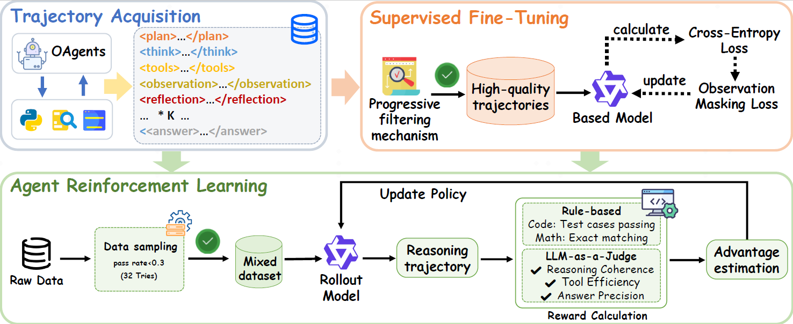
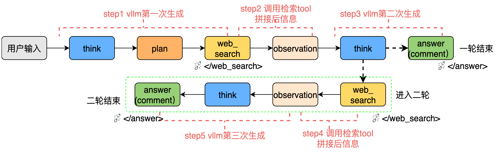
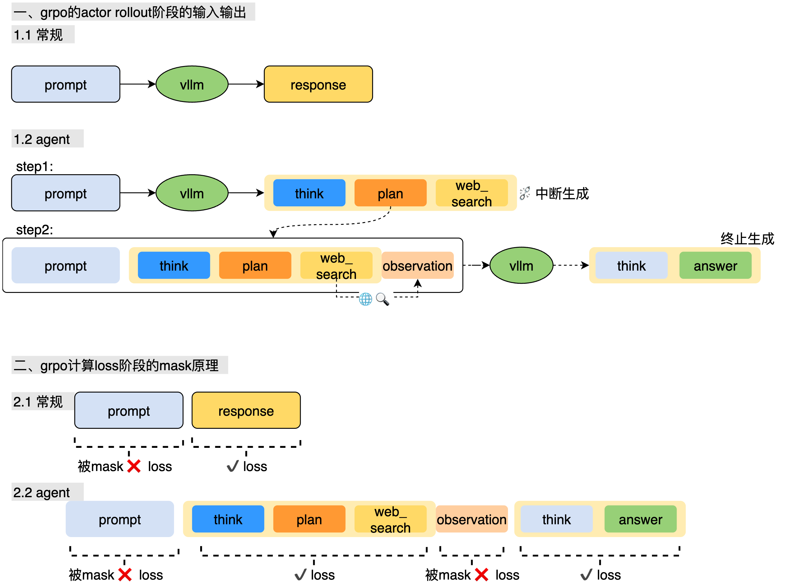
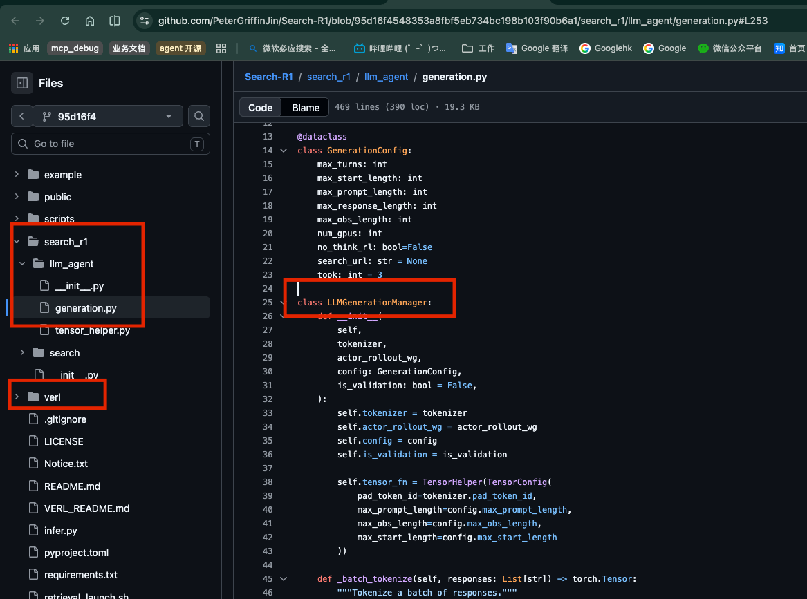
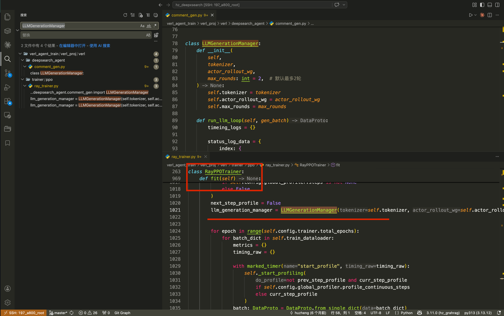

# 记录一次评论场景下的 Agent SFT 与 RL 训练实践


今天是五一假期第二天，照也拍了，视频也刷够了，干脆把去年做的事情整理出来分享一下。一方面是给自己做个记录，免得时间久了细节都忘干净了；另一方面，希望对同样在做 Agent 训练的朋友有些参考价值。

这次 Agent 训练的主要工作从 25 年 8 月持续到 25 年 12 月，完整覆盖了数据构建、SFT 监督微调和 RL 强化学习训练三个阶段。此后的时间则主要集中在数据质量优化和奖励模型的迭代改进上。

关于数据构造的细节，这里不会展开太多——这部分涉及一些敏感内容，主要还是聚焦在代码层面的踩坑经历上。

## 任务背景

核心需求很简单：当机器人遇到一条合适的博文时，希望它生成的评论既有真实的检索依据，又带有"人味"。为此，Agent 看到博文后的第一步就是检索——往哪个方向检索、检什么 query，这些决策直接决定了最终评论的质量与自然程度。

工具配置上也相对简洁：整个 Agent 只需要一个 `search` 工具，没有其他多余依赖。不过，检索方向的把控确实是个难点，导致数据构造异常困难，好在最终基本克服了这一问题。

## 技术路线选型

25 年 8 月时，可参考的 Agent 方案其实并不多，当时视野内有：阿里系的 Deep Research、Kimi 的 Researcher、问小白的 Deep Research Bench，以及 OPPO 的 COA（Chain of Agents，链式智能体框架）。

最终选择了 COA 的思路。原因在于：COA 在单任务场景中只调用一种工具（如仅用 web-search），与评论生成任务的工具使用模式高度契合，却依然取得了不错的效果。另外，COA 的数据构造恰好使用了我当时最喜欢的 Agent 框架 smolagents——这也算是一点小缘分，哈哈。


## CoA 方案

### CoA介绍


COA：是oppo发布的一篇论文[https://chain-of-agents-afm.github.io/](https://chain-of-agents-afm.github.io/)，在这篇论文里面，提出了“链式智能体”（Chain of Agents COA）框架，用多智能体蒸馏+智能体强化学习，一次性训练出端到端的智能体基础模型（AFM）。
通过轨迹构建、SFT、RL三段式流程，首次实现了端到端的多Agent协作推理模式，在web、code、math等领域取得突破性性能。




### CoA 数据格式解析

以下以 `PersonalAILab/AFM-MHQA-Agent-SFT-Dataset` 中的一条数据（中文翻译版）为例，逐步拆解其格式。

**sys_prompt**（系统提示词）：

```markdown

你只能使用以下6个函数来回答给定问题：think、plan、wiki_search、observation、reflection和answer。以下是这些函数的描述：

1. think：在使用plan、wiki_search、reflection或answer函数之前，你必须首先使用think函数来提供推理、论证和你打算使用的下一个函数的程序步骤。以<think>开头，以</think>结尾。

2. plan：根据给定的问题，你必须将其分解为非常详细、细粒度的子问题，以便使用wiki_search函数执行。以<plan>开头，以</plan>结尾。

3. wiki_search：你可以使用wiki_search函数检索外部信息来回答问题。以<wiki_search>开头，以</wiki_search>结尾。
你应该这样使用wiki_search函数：
<wiki_search>搜索查询</wiki_search>

4. observation：此函数表示使用工具函数后返回的结果。以<observation>开头，以</observation>结尾。

5. reflection：评估和反思当前轨迹的步骤。如有必要，为修改计划和wiki_search提供一些建议。以<reflection>开头，以</reflection>结尾。

6. answer：你的回应必须在最后包含answer函数，表明你对最终答案有信心。以<answer>开头，以</answer>结尾。

重要说明：
1. 你只能使用这些函数来构建正确的推理路径并得出给定问题的最终答案。
2. 基于plan函数的结果，你可以多次使用wiki_search函数收集足够的外部知识，然后制定回应。
3. 反思后，你必须使用think函数指导下一步，下一步必须是plan或wiki_search，除非你完全确定已经得到答案。输出格式：
<reflection>...</reflection><think>...</think><plan>...</plan><think>...</think> 或 <reflection>...</reflection><think>...</think><wiki_search>...</wiki_search><think>...</think>
4. 除非你完全确定，否则不要轻易给出答案。答案应该尽可能简洁，避免详细说明。例如，<answer>北京</answer>。
5. 在使用plan、wiki_search、reflection或answer函数之前，你必须使用think函数。
6. 特殊标记限制：
<think>、<plan>、<wiki_search>、<observation>、<reflection>和<answer>是特殊标记，不得出现在自由文本中，特别是不能出现在think函数内。
```


**user_input**（用户输入）：
```markdown
问题：约翰·弗兰肯海默（John Frankenheimer）和蒂法妮·德巴托罗（Tiffanie DeBartolo）共同的职业是什么？
```


**output**（模型输出，带注释）：
```markdown

<think>要回答关于约翰·弗兰肯海默和蒂法妮·德巴托罗共同职业的问题，我首先需要搜索每个人的主要职业。然后，我将比较他们的职业以识别任何重叠。为了高效地做到这一点，我将把问题分解为两个具体的子问题："约翰·弗兰肯海默的职业是什么？"和"蒂法妮·德巴托罗的职业是什么？"</think>  #注释：1 第一次think

<plan>
1. 查找约翰·弗兰肯海默的职业。
2. 查找蒂法妮·德巴托罗的职业。
3. 识别两个人共同的职业。
</plan>。#注释： 2 开始规划

<think>我将首先搜索约翰·弗兰肯海默的职业。</think> #注释： 3 检索前的think

<wiki_search>约翰·弗兰肯海默 职业</wiki_search> #注释：4  进行检索

<observation>文档1（标题："约翰·弗兰肯海默"）约翰·弗兰肯海默 约翰·迈克尔·弗兰肯海默（1930年2月19日-2002年7月6日）是美国电影和电视导演，以社会剧和动作/悬疑片闻名。他的作品包括《阿尔卡特拉斯的鸟人》（1962年）、《满洲候选人》（1962年）、《五月七日》（1964年）、《火车》（1964年）、《几秒钟》（1966年）、《大奖赛》（1966年）、《法国贩毒网2》（1975年）、《黑色星期天》（1977年）和《浪人》（1998年）。弗兰肯海默在1990年代因导演电视电影《对抗围墙》、《燃烧季节》、《安德森维尔》和《乔治·华莱士》赢得了四项艾美奖——连续三项，后者还获得了金球奖最佳迷你剧或电视电影奖。
文档2（标题："约翰·弗兰肯海默"）他被认为是最后一批坚持对制作所有元素拥有完全控制权的导演之一，这使他的风格在好莱坞独树一帜。弗兰肯海默的30部故事片和50多部电视剧因其对当代思想的影响而著名。他成为"现代政治惊悚片"的先驱，从冷战高峰时期开始他的职业生涯。他在现场电视时代就技术精湛；他的许多电影以为男主角创造"心理困境"和强烈的"环境感"而著名，风格相似
文档3（标题："约翰·弗兰肯海默"）希迪。他的父亲是德国犹太人后裔，母亲是爱尔兰天主教徒，弗兰肯海默按照母亲的宗教信仰成长。他在纽约市长大，很小就对电影产生兴趣；他回忆每个周末都去电影院。1947年，他从纽约长岛奥克代尔的拉萨勒军事学院毕业。1951年，他从马萨诸塞州威廉斯敦的威廉姆斯学院英语专业毕业。他在大学期间也对表演产生兴趣，但在空军服役时开始认真考虑导演工作</observation>

<think>计划的第一步——查找约翰·弗兰肯海默的职业——得到了正确执行。wiki_search产生了明确的证据，表明约翰·弗兰肯海默是一名电影和电视导演。这个轨迹步骤没有出现错误。下一步应该是类似地搜索蒂法妮·德巴托罗的职业，如计划中所述，以便进行比较。此时不需要基于反思的计划修改。</think>#注释：5  在反思之前再次think

<reflection>到目前为止的计划和执行都是正确的。弗兰肯海默职业的搜索是成功的，产生了有用的信息。继续按计划搜索蒂法妮·德巴托罗的职业，然后进行比较。此步骤不需要修改。</reflection> #注释：6  开始反思

<think>确定了约翰·弗兰肯海默是电影和电视导演后，我现在需要确定蒂法妮·德巴托罗的职业。这将使我能够比较两个人的职业并识别任何共同的职业。下一个逻辑步骤是专门为蒂法妮·德巴托罗的职业执行wiki_search。</think>

<wiki_search>蒂法妮·德巴托罗 职业</wiki_search> #注释：7 再次进行检索

<observation>文档1（标题："蒂法妮·德巴托罗"）蒂法妮·德巴托罗 蒂法妮·德巴托罗（1970年11月27日出生）是美国小说家、电影制作人，也是独立唱片公司Bright Antenna的联合创始人。她写了两部小说，《上帝形状的洞》和《如何杀死摇滚明星》。她编写并导演了电影《失眠者的梦想》，主演詹妮弗·安妮斯顿，但该片在1996年发行极为有限。德巴托罗是前旧金山49人队老板爱德华·J·德巴托罗二世的女儿。她就读于全女子学校玛丽亚别墅高中，在高年级时辍学，因为学校不让她提前毕业。她后来获得了GED并从

文档2（标题："蒂法妮·德巴托罗"）加州大学伯克利分校哲学学位毕业，然后搬到洛杉矶。她曾住在纽约市和科罗拉多州博尔德，现在居住在旧金山湾区。她的小说写作生涯始于她的编剧/导演处女作之后，《上帝形状的洞》于2002年出版，《如何杀死摇滚明星》于2005年出版，两本都由Sourcebooks Landmark出版。西德尼·谢尔顿赞扬了她的第二部小说，说它有"精彩的角色包裹在一个像特快列车一样移动的故事中"。《上帝形状的洞》在英国以《我心的形状》出版。她最近完成了

文档3（标题："蒂法妮·德巴托罗"）关于美国音乐家杰夫·巴克利的图画小说文本工作。她是位于加利福尼亚州奥克兰的独立音乐唱片公司Bright Antenna的所有者之一，该公司发行了Middle Class Rut、Jimmy Gnecco、The Wombats、Magic Wands、Orchestral Manoeuvres in the Dark、Flagship、Beware of Darkness和Cheerleader的音乐。蒂法妮·德巴托罗 蒂法妮·德巴托罗（1970年11月27日出生）是美国小说家、电影制作人，也是独立唱片公司Bright Antenna的联合创始人。她写了两部小说，《上帝形状的洞》和《如何杀死摇滚明星》。她编写并导演了电影《失眠者的梦想》，

文档4（标题："爱德华·J·德巴托罗二世"）看到（蒙大拿）向（德巴托罗）传球获得最后的触地得分，听到球迷疯狂呐喊，看到朗尼·洛特和乔·蒙大拿等前球员的钦佩；对我来说这令人印象深刻...对我来说，这就是一切的意义所在。德巴托罗有三个女儿，丽莎、妮可和蒂法妮。蒂法妮是作家，也是电影《失眠者的梦想》（1996年）的导演。2007年，德巴托罗与职业足球名人堂成员德里克·布鲁克斯共同创立了佛罗里达州坦帕的布鲁克斯-德巴托罗大学高中。在德巴托罗的早期生活中，他在一个小镇长大

文档5（标题："滕比·洛克"）美国，她从康涅狄格州卫斯理大学获得艺术史学位。她说一口流利的意大利语。大学毕业后，洛克搬到纽约市，在CBS连续剧《世界转动》工作，同时白天上学，晚上当服务员。她在Circle in the Square与威廉·埃斯珀一起学习。洛克和她的丈夫（一位意大利厨师）在加利福尼亚州洛杉矶生活和工作。她是素食主义者和城市自给自足者，经常在城市空地上种植农产品。洛克是美食烹饪师，也喜欢徒步旅行、跑步和钓鱼。</observation>

<think>从搜索结果中，蒂法妮·德巴托罗的职业信息现在很清楚了。她被描述为小说家和电影制作人，也被提及为电影《失眠者的梦想》的导演。约翰·弗兰肯海默之前被确认为电影和电视导演。两个人都有"电影导演"的职业（或类似的头衔，如电影制作人/导演）。因此，约翰·弗兰肯海默和蒂法妮·德巴托罗之间的共同职业是"电影导演"（或简单地说：导演/电影制作人）。我现在准备提供最终答案。</think> #注释：8 在回答之前，再次进行思考
<answer>导演</answer>  #注释：9 输出最终的答案
```


**格式总结：** 数据由三部分组成——`sys_prompt` → `user_input` → `output`。

1. `sys_prompt`：定义 Agent 可用的工具函数及其调用规范。
2. `user_input`：用户提出的具体问题。
3. `output`：模型按以下固定流程循环推理，直至得出答案：
   `think` → `plan` → `think` → `wiki_search` → `observation` → `think` → `reflection` → `think` → `wiki_search` → `observation` → `think` → `answer`
   - 每个动作（`plan`、`wiki_search`、`reflection`、`answer`）前都必须先输出 `think`。
   - `wiki_search` 每次只包含一条检索 query。
   - `observation` 是工具实际执行检索后返回的结果。


### 改进思路

没有直接沿用 COA 的原始格式，主要出于两方面考虑：推理长度和工具调用效率。

1. **冗余的 think + reflection**：`plan`、`wiki_search` 前都必须先 `think`，每次检索还要插入 `reflection`，导致 token 消耗极大，整体轨迹偏长。`plan` 和 `think` 固然关键，`reflection` 也有其价值，但在每次 `web_search` 前都重复一遍，实在太重了。
2. **串行检索的浪费**：很多情况下多条 query 完全可以并行发出。就拿上面的例子来说，`约翰·弗兰肯海默 职业` 和 `蒂法妮·德巴托罗 职业` 这两个检索毫无依赖关系，并行执行即可，原格式却强制串行，白白浪费了时间。

基于以上问题，对 `output` 的轨迹格式做了精简：

- **简单版**：`think` → `plan` → `web_search` → `observation` → `think` → `answer`
- **复杂版**：`think` → `plan` → `web_search` → `observation` → `think` → `web_search` → `observation` → `think` → … × N → `answer`


至此，数据格式基本确定。接下来的重点转向两个工程环节：SFT 训练框架的适配，以及 vLLM 推理侧的调用逻辑改造。

> 约定：后文以 `<tag>xxx</tag>` 的形式表示 output 中各区域的标签块。

---

## SFT 训练

**1. 训练框架重构**

COA 项目原本基于 LLaMA-Factory 进行了二次开发。由于本次业务数据格式与 COA 存在差异，直接沿用原框架会导致训练失败，因此改用 TRL 对训练流程进行重构。

**2. Mask 边界问题（最大坑点）**

在对 Agent 进行 SFT 训练时，需要在计算 loss 时将 `<observation>` 与 `</observation>` 之间的全部内容（含标签本身）Mask 掉，使其不参与梯度更新。

然而实践中发现：不同的前缀或后缀组合会改变分词结果，进而干扰训练效果。这是整个过程中最难排查的坑。

**3. 解决方案**

- 检索内容统一包裹在 `<observation> ... </observation>` 标签内。
- 解析逻辑匹配的实际格式为 `<observation> ... </observation>\n\n`。
- 格式规范：`<observation>` 后跟一个空格，`observation>` 后跟两个换行符。

下面的编码结果直观展示了前缀差异对 tokenization 的影响：

```python
tokenizer.encode("</observation>")     # [522, 77960, 29] 
tokenizer.encode("}</observation>")    # [5361, 77960, 29] 
tokenizer.encode(" </observation>")    # [690, 77960, 29]
tokenizer.encode("\n</observation>")   # [198, 522, 77960, 29]
tokenizer.encode("\n</observation>\n") # [198, 522, 77960, 397]


[['</', 'observation', '>'],
 ['}</', 'observation', '>'],
 [' </', 'observation', '>'],
 ['\n', '</', 'observation', '>'],
 ['\n', '</', 'observation', '>\n']]
```

可以看到，仅仅是前置字符不同（空格、换行、`}`），`</observation>` 的 token 序列就会发生变化，因此必须严格统一格式。

---

## vLLM 推理

**1. 推理中断与终止条件**

在推理过程中，通过以下两个条件控制输出流程：
- 生成内容中出现 `</web_search>` 时，**暂停**本次推理，触发检索。
- 生成内容中出现 `</answer>` 时，**终止**整个推理流程。

**2. 检索结果拼接与续接推理**

从 `</web_search>` 中提取 query 列表，调用搜索接口获取内容，将结果填入 `<observation>` 块，再按 SFT 阶段约定的格式拼接后重新提交给模型，继续后续推理。

**3. 推理轮次上限**

为防止无限循环，设置最大推理轮次为 N。若在 N 轮内未能输出 `</answer>`，则判定本次推理失败。

整个流程完全在客户端通过文本拼接与逻辑调度实现，无需修改 vLLM 框架本身的任何代码。





---

## GRPO 训练

强化学习算法采用 GRPO，在 verl 框架基础上适配了当前推理链路，参考了 search-r1 和 verl-agent 的实现，完成了 agent loop 训练流程的搭建。

这部分可说的东西很多，框架搭建阶段需要完成以下几项核心工作：

1. **指标监控**：在 verl 中接入 agent 推理耗时统计（总耗时、第一轮检索耗时、第二轮检索耗时），并在每个训练步骤展示奖励模型各维度的统计结果。
2. **agent loop 核心逻辑**：实现检索触发机制与并行检索。在 agent 生成过程中，遇到特定 token 时中断生成，提取同批同轮次的所有 query 并行发起检索，将检索结果拼接后继续生成。这部分逻辑与 vLLM 推理章节的实现本质相同，区别在于需要融合进 verl 的 rollout 模块（使用的是 vLLM 后端，而非 sglang）。
3. **observation mask**：对 `<observation>` 区域做 mask 处理，避免该部分 token 参与 loss 计算。
4. **奖励模型接入**：自定义奖励模型接口，通过 HTTP 服务形式批量接收数据，在接口侧并行调用奖励模型评分。



## 踩坑 1：agent loop 与 verl rollout 的融合

个人认为整个工程中最难的部分还是 agent loop——虽然逻辑上与 vLLM 推理调用是一回事，但融合进 verl 的 rollout 模块（vLLM 后端）后，又是另一番复杂度。

**1. 整体结构参考 search-r1**

参照 search-r1 的设计，新建了 `LLMGenerationManager` 类，该类负责：遇到特定 token 中断生成、执行检索、调用 verl rollout、拼接结果、构造 mask 等完整流程。随后在 `RayPPOTrainer` 的 `fit` 方法和 `_validate` 方法中，将 verl 原生的 `LLMGeneration` 替换为该类。




**2. 为 rollout 增加 stop_words 支持**

到这一步还没结束，还需要修改 verl 的 `actor_rollout_wg.generate_sequences`，因为原生接口不支持传入 `stop_words`。

翻看 search-r1 的代码会发现它也没有使用 `stop_words`，而是采用了另一种方式：让 rollout 生成到自然结束，再通过字符串切割提取目标片段（如按 `</search>` 切割取前半段）。这种方式实现简单，但存在不必要的生成浪费，因此在此基础上扩展支持了 `stop_words` 参数传递。

```python

# https://github.com/PeterGriffinJin/Search-R1/blob/95d16f4548353a8fbf5eb734bc198b103f90b6a1/search_r1/llm_agent/generation.py#L253
    def _postprocess_responses(self, responses: torch.Tensor) -> torch.Tensor:
        """Process responses to stop at search operation or answer operation."""
        responses_str = self.tokenizer.batch_decode(
            responses, 
            skip_special_tokens=True
        )

        responses_str = [resp.split('</search>')[0] + '</search>'
                 if '</search>' in resp 
                 else resp.split('</answer>')[0] + '</answer>'
                 if '</answer>' in resp 
                 else resp
                 for resp in responses_str]

        if self.config.no_think_rl:
            raise ValueError('stop')
            # if no_think_rl is enabled, only keep action in the str
            actions, _ = self.env.postprocess_predictions(responses_str)
            responses_str=[f"<answer>{envs[idx].ACTION_LOOKUP[action]}</answer>" for idx, action in enumerate(actions)]
            print("RESPONSES:", responses_str)
        responses = self._batch_tokenize(responses_str)
        return responses, responses_str

```

## 踩坑 2：多机训练时各节点 rollout 数量必须一致

多机训练时，verl 要求每台机器在每轮 rollout 中处理的样本数量完全相同，否则会报错。

举个例子：一批 8 条数据，在 agent loop 第一轮结束后，有 5 条已完成推理，剩余 3 条需要进入第二轮。若第一台机器分到 2 条未完成样本、第二台机器分到 1 条，数量不对齐就会导致推理报错。

**解决方案**：第一轮已完成的样本不从队列中移除，而是继续保留在第二轮的批次中作为「占位符」。由于设置了 `stop_words`，这些样本在 verl vLLM 内部几乎不消耗额外资源。取第二轮结果时，再将第一轮已完成的样本过滤掉即可。

这个问题应该和当时使用的 verl 版本有关，不确定近期版本是否已修复。


## 踩坑 3：全程只操作 token id，不做中间 decode/encode

前面多次提到，tag 与周围内容的不同组合会影响分词结果，导致 token id 发生变化。因此在设计 agent loop 时，有一条铁律：**全程只操作 token id list，不在中间环节将 token decode 成文本后再重新 tokenize**。

唯一的例外是 debug 阶段，可以将 token list 转换成文本方便肉眼核查，但生产逻辑中绝对不能这样做。


框架搞完了，基本上就是调整数据，改奖励模型。
奖励模型主要是考虑到几个维度：比如首个think相关性；第二次think相关性。内容的友善度、格式奖励等。计算规则也从最开始的加权，改到后面的递进式和rubrics。细节就不展开了。


