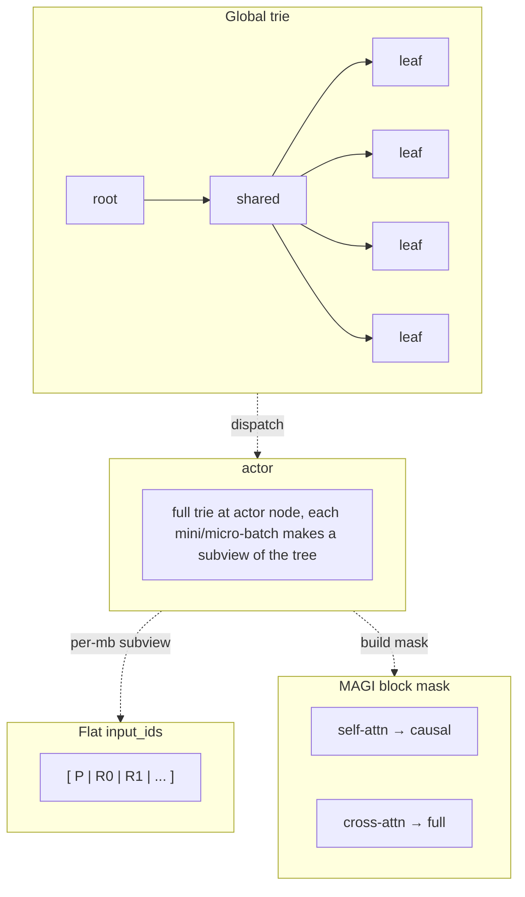

# Prefix-Tree (MAGI) Attention for Shared-Prefix Training

**Author:** `https://github.com/meituan-search`

Last updated: 07/22/2026.

This document covers the **design and usage** of the prefix-deduplicated attention system (MAGI). Implementation detail — parallelism internals, the full call/data-flow graph, dynamic micro-batching, diagnostics — lives in [`verl/utils/prefix_tree/README.md`](../../verl/utils/prefix_tree/README.md).

## 1. Background

In GRPO and multi-turn RL, the same prompt is rolled out `n` times (`rollout.n`), producing `n` responses that share an identical prompt prefix. Standard attention processes the prompt tokens `n` times — once per rollout — wasting compute proportional to `prompt_len * (n - 1)`. For long-context reasoning (8k–128k prompt tokens, `n=8`), this overhead dominates training cost.

The prefix-tree (MAGI) system builds a compressed trie over the batch's sequences, identifies shared prefixes, and packs them into a flat token layout where shared tokens appear once. A custom attention kernel computes attention over this packed layout using a block-sparse mask derived from the trie structure, so each rollout attends to its own prompt tokens without duplicating the forward pass.

## 2. When to Use

Enable prefix-tree when there is **long shared-prefix length between samples** in a batch — i.e. many sequences share a substantial common prefix, so deduplicating it saves real compute. Typical cases:

- **GRPO** (`rollout.n >= 2`) — each prompt produces `n` responses sharing the prompt prefix.
- **Multi-turn / branching algorithms** — accumulated tool-call context shared across turns, or tree-search-style rollouts where child branches share a parent prefix.
- **Long shared system prompt** — many samples share a long system / few-shot prefix regardless of rollout count.

Do **not** enable when:

- Each sample has a unique prompt (no sharing) — the trie build + dispatch overhead is pure cost (see Known limitations below).
- `rollout.n == 1` and no multi-turn accumulation — no prefix sharing to exploit.

> **Custom algorithms with known sharing structure.** The default tree build is token-by-token (`greedy_build_tries`, `dynamic.py`). If your algorithm already knows the prefix structure (e.g. tree-search branches sharing a parent prefix), attach per-sample `segment_hashes` + `segment_lengths` to `non_tensor_batch` (built via `create_segment_metadata` / `create_grpo_segment_metadata` in `segment_grouper.py`) so `build_global_trie` uses the O(N) `build_global_tree_from_segments` (`tree.py`) — which matches segment hashes level by level instead of comparing tokens — rather than the greedy by-token path. GRPO wires this via `attach_segment_metadata`.

## 3. Configuration

Prefix-tree is controlled by two fields under `actor_rollout_ref.model`:

| Field | Default | Values | Description |
|-------|---------|--------|-------------|
| `use_prefix_tree` | `false` | `true` / `false` | Enable prefix-tree trie build + packed layout |
| `prefix_tree_attention` | `magi` | `magi` / `flex` | Attention backend. `magi` uses the magi_attention kernel; `flex` uses `torch.nn.attention.flex_attention` with a block mask. |

Example:

```bash
python3 -m verl.trainer.main_ppo \
    actor_rollout_ref.model.use_prefix_tree=True \
    actor_rollout_ref.model.prefix_tree_attention=magi \
    ... # other config
```

A complete runnable GRPO example (Megatron, CP=4, `rollout.n=8`) is at [`examples/grpo_trainer/run_grpo_prefix_tree_magi_megatron.sh`](../../examples/grpo_trainer/run_grpo_prefix_tree_magi_megatron.sh).

### Backend selection

- **`magi`** (default): uses the `magi_attention` package's distributed attention kernel. Supports TP + CP + SP. Required for the highest sharing ratios (cross-CP-rank attention). Falls back to FA3 if the magi key is not available.
- **`flex`**: uses `torch.nn.attention.flex_attention` with a block-sparse mask derived from the trie. Simpler dependency, no custom kernel, no CP support. Good for CPU testing or when `magi_attention` is not installed.

## 4. How it works

A shared prompt `P` rolled out 4× collapses into one shared node; the flat layout lays every token once:

```
[P R0] [P R1] [P R2] [P R3]   →   flat layout:  [ P | R0 | R1 | R2 | R3 ]
```

The global trie dedups shared prefixes into single nodes; the trainer dispatches the full trie to each actor, which builds a per-micro-batch subview; that view's flat `input_ids` and a tree-derived block mask feed MAGI attention — self-attn is causal, cross-attn (to a shared prefix) is full:



Each box:

- **Global trie** — one `TrieNode` root with a flat DFS-ordered `nodes` list; each non-root node holds its token run (`input_ids`), the samples sharing it (`sequence_ids`), and a stable `flat_idx`.
- **Actor** — receives the full trie (dispatched once); each mini/micro-batch prunes it to a `PrefixSubTrie` covering only its own leaves.
- **Flat input_ids** — the subview's nodes laid out in DFS order; shared `P` appears once, each response once.
- **MAGI block mask** — self-attn blocks are causal, cross-attn blocks (response → shared prefix) are full.

The resulting block-sparse mask over `[ P | R0 | R1 | R2 | R3 ]` (`full` = attend, `causal` = lower-triangular, `·` = masked):

```
        P        R0       R1       R2       R3
   ┌──────────┬────────┬────────┬────────┬────────┐
 P │  causal  │   ·    │   ·    │   ·    │   ·    │   P sees only itself
   ├──────────┼────────┼────────┼────────┼────────┤
R0 │   full   │ causal │   ·    │   ·    │   ·    │   R0 sees P + itself
   ├──────────┼────────┼────────┼────────┼────────┤
R1 │   full   │   ·    │ causal │   ·    │   ·    │   R1 sees P + itself
   ├──────────┼────────┼────────┼────────┼────────┤
R2 │   full   │   ·    │   ·    │ causal │   ·    │
   ├──────────┼────────┼────────┼────────┼────────┤
R3 │   full   │   ·    │   ·    │   ·    │ causal │
   └──────────┴────────┴────────┴────────┴────────┘
```

Shared-prefix blocks are full; each segment self-block is causal; cross-response blocks (R0↔R1, …) are masked.

`P` is processed once instead of once per rollout. See the README for the full call/data-flow graph.

## 5. Metrics

When enabled, the trainer emits a `prefix_tree/` metric group:

| Metric | Meaning |
|--------|---------|
| `global_shared_ratio` | Fraction of tokens saved by deduplication across the whole batch. |
| `micro_batch_shared_ratio` | Mean per-micro-batch sharing ratio, using the same grouping the live mbs path uses. |
| `packed_tokens` | Deduplicated packed-trie token count. |
| `raw_tokens` | Total raw token count across all sequences (pre-dedup). |
| `avg_mbs` | Average sequences per micro-batch (dynbsz only). |
| `attn_fa3_fallback_ratio` | Fraction of attention calls that fell back to FA3. |
| `timing_s` | Wall-clock seconds spent building the trie. |

`raw_tokens` counts **valid (unpadded) tokens** across all sequences; padding is stripped via the attention mask before counting. `packed_tokens / raw_tokens` roughly equals `1 - global_shared_ratio`. See the README for aggregation rules (metrics must be wrapped in `Metric` before the allgather step).

## 6. Experiment result

Results and full curves on wandb: <https://wandb.ai/arvyanh-mt/verl_prefixtree>

Base (no prefix-tree) vs MAGI prefix-tree, on two workloads — `longreason` (a long-prompt QA dataset) and `asearch` (multi-turn search implemented using uniagent). `ratio` is the prefix shared ratio (%); `update_actor` and `e2e` are the per-step actor-update and end-to-end times (s):

| Workload | ratio (%) | update_actor (s) | e2e (s) |
|---|---|---|---|
| base longreason | – | 82 | 186 |
| magi longreason | 80 | 21 | 69 |
| base asearch | – | 133 | 370 |
| magi asearch | 35 | 82 | 300 |

## 7. Known limitations

- **TP and SP are mutually exclusive.** When `tensor_model_parallel_size > 1`, sequence parallelism must be disabled (`actor_rollout_ref.actor.megatron.sequence_parallel=False`); the prefix-tree path does not support SP with TP.
- **Linear attention is not supported yet.** Only the `magi` / `flex` / FA3-fallback attention backends work; linear-attention variants fall back to the standard path.
- **Dispatch overhead can dominate at low sharing.** Building the trie and dispatching the packed layout has a fixed cost; when the shared-prefix length is very short the dedup saving may not cover it, giving a net negative gain.
- **DP load balance is not fully optimized.** The current DFS + contiguous partition balances token counts across DP ranks, but does not yet optimally co-locate prefix-sharing samples across ranks in all cases.

## 8. Dependencies

- `magi_attention` package (for the `magi` backend). Install from [magi-attention/magi-attention](https://github.com/magi-attention/magi-attention).
- Megatron-LM (for the attention patch). The patch targets `TEDotProductAttention` from `megatron.core.transformer.attention`.
