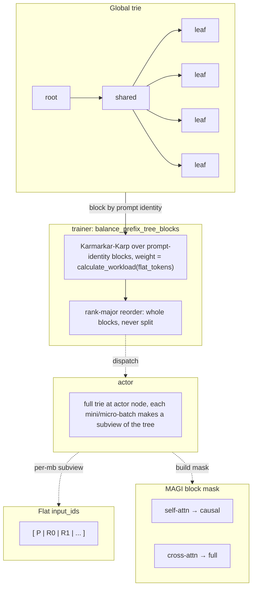

# Prefix-Tree (MAGI) Attention for Shared-Prefix Training

**Author:** `https://github.com/meituan-search`

Last updated: 08/13/2026.

This document covers the **design and usage** of the prefix-deduplicated attention system (MAGI). Implementation detail — parallelism internals, the full call/data-flow graph, dynamic micro-batching, diagnostics — lives in [`verl/utils/prefix_tree/README.md`](../../verl/utils/prefix_tree/README.md).

## 1. Background

In GRPO and multi-turn RL, the same prompt is rolled out `n` times (`rollout.n`), producing `n` responses that share an identical prompt prefix. Standard attention processes the prompt tokens `n` times — once per rollout — wasting compute proportional to `prompt_len * (n - 1)`. For long-context reasoning (8k–128k prompt tokens, `n=8`), this overhead dominates training cost.

The prefix-tree (MAGI) system builds a compressed trie over the batch's sequences, identifies shared prefixes, and packs them into a flat token layout where shared tokens appear once. A custom attention kernel computes attention over this packed layout using a block-sparse mask derived from the trie structure, so each rollout attends to its own prompt tokens without duplicating the forward pass.

## 2. When to Use

Enable prefix-tree when there is **long shared-prefix length between samples** in a batch — i.e. many sequences share a substantial common prefix, so deduplicating it saves real compute. Typical cases:

- **GRPO** (`rollout.n >= 2`) — each prompt produces `n` responses sharing the prompt prefix.
- **Multi-turn / branching algorithms** — accumulated tool-call context shared across turns, or tree-search-style rollouts where child branches share a parent prefix.
- **Long shared system prompt** — many samples share a long system / few-shot prefix regardless of rollout count.

Do **not** enable when:

- Each sample has a unique prompt (no sharing) — the trie build + dispatch overhead is pure cost (see Known limitations below).
- `rollout.n == 1` and no multi-turn accumulation — no prefix sharing to exploit.

## 3. Configuration

Prefix-tree is controlled by two fields under `actor_rollout_ref.model`:

| Field | Default | Values | Description |
|-------|---------|--------|-------------|
| `use_prefix_tree` | `false` | `true` / `false` | Enable prefix-tree trie build + packed layout |
| `prefix_tree_attention` | `magi` | `magi` / `flex` | Attention backend. `magi` uses the magi_attention kernel; `flex` uses `torch.nn.attention.flex_attention` with a block mask. |

Example:

```bash
python3 -m verl.trainer.main_ppo \
    actor_rollout_ref.model.use_prefix_tree=True \
    actor_rollout_ref.model.prefix_tree_attention=magi \
    ... # other config
```

A complete runnable GRPO example (Megatron, CP=4, `rollout.n=8`) is at [`examples/grpo_trainer/run_grpo_prefix_tree_magi_megatron.sh`](../../examples/grpo_trainer/run_grpo_prefix_tree_magi_megatron.sh).

### Backend selection

- **`magi`** (default): uses the `magi_attention` package's distributed attention kernel. Supports TP + CP + SP. Required for the highest sharing ratios (cross-CP-rank attention). Falls back to FA3 if the magi key is not available.
- **`flex`**: uses `torch.nn.attention.flex_attention` with a block-sparse mask derived from the trie. Simpler dependency, no custom kernel, no CP support. Good for CPU testing or when `magi_attention` is not installed.

## 4. How it works

A shared prompt `P` rolled out 4× collapses into one shared node; the flat layout lays every token once:

```
[P R0] [P R1] [P R2] [P R3]   →   flat layout:  [ P | R0 | R1 | R2 | R3 ]
```

The global trie dedups shared prefixes into single nodes; the trainer dispatches the full trie to each actor, which builds a per-micro-batch subview; that view's flat `input_ids` and a tree-derived block mask feed MAGI attention — self-attn is causal, cross-attn (to a shared prefix) is full:


```mermaid
graph TD
    subgraph T["Global trie"]
        R[root]
        P["shared"]
        R --> P
        P --> L0["leaf"]
        P --> L1["leaf"]
        P --> L2["leaf"]
        P --> L3["leaf"]
    end
    subgraph B["trainer: balance_prefix_tree_blocks"]
        K["Karmarkar-Karp over prompt-identity blocks, weight = calculate_workload(flat_tokens)"]
        O["rank-major reorder: whole blocks, never split"]
    end
    subgraph W["actor"]
        V["full trie at actor node, each mini/micro-batch makes a subview of the tree"]
    end
    subgraph F["Flat input_ids"]
        F1["[ P | R0 | R1 | ... ]"]
    end
    subgraph M["MAGI block mask"]
        M1["self-attn → causal"]
        M2["cross-attn → full"]
    end
    T -->|"block by prompt identity"| K
    K --> O
    O -.->|dispatch| W
    W -.->|per-mb subview| F
    W -.->|build mask| M
```

Each box:

- **Global trie** — one `TrieNode` root with a flat DFS-ordered `nodes` list; each non-root node holds its token run (`input_ids`), the samples sharing it (`sequence_ids`), and a stable `flat_idx`.
- **Trainer balance** — blocks are prompt-identity groups (the GRPO advantage group); Karmarkar-Karp assigns whole blocks to ranks, samples reordered rank-major.
- **Actor** — receives the full trie (dispatched once); each mini/micro-batch prunes it to a `PrefixSubTrie` covering only its own leaves.
- **Flat input_ids** — the subview's nodes laid out in DFS order; shared `P` appears once, each response once.
- **MAGI block mask** — self-attn blocks are causal, cross-attn blocks (response → shared prefix) are full.

Multi-level tree (P shared by all, A shared by R0/R1, B shared by R2/R3):

```
Samples:
  [P A R0]  [P A R1]  [P B R2]  [P B R3]

Compressed trie:
  root
   └─ P (shared prefix)
       ├─ A (shared by R0, R1)
       │   ├─ leaf: R0
       │   └─ leaf: R1
       └─ B (shared by R2, R3)
           ├─ leaf: R2
           └─ leaf: R3

Flat packed layout (tokens processed once):
  ┌───┬───┬───┬────┬────┬────┬────┐
  │ P │ A │ B │ R0 │ R1 │ R2 │ R3 │
  └───┴───┴───┴────┴────┴────┴────┘
```

The resulting block-sparse mask over `[ P | A | B | R0 | R1 | R2 | R3 ]`
(`full` = attend, `causal` = lower-triangular, `·` = masked):

```
        P        A        B        R0       R1       R2       R3
   ┌────────┬────────┬────────┬────────┬────────┬────────┬────────┐
 P │ causal │    ·   │    ·   │    ·   │    ·   │    ·   │    ·   │
   ├────────┼────────┼────────┼────────┼────────┼────────┼────────┤
 A │  full  │ causal │    ·   │    ·   │    ·   │    ·   │    ·   │
   ├────────┼────────┼────────┼────────┼────────┼────────┼────────┤
 B │  full  │    ·   │ causal │    ·   │    ·   │    ·   │    ·   │
   ├────────┼────────┼────────┼────────┼────────┼────────┼────────┤
R0 │  full  │  full  │    ·   │ causal │    ·   │    ·   │    ·   │
   ├────────┼────────┼────────┼────────┼────────┼────────┼────────┤
R1 │  full  │  full  │    ·   │    ·   │ causal │    ·   │    ·   │
   ├────────┼────────┼────────┼────────┼────────┼────────┼────────┤
R2 │  full  │    ·   │  full  │    ·   │    ·   │ causal │    ·   │
   ├────────┼────────┼────────┼────────┼────────┼────────┼────────┤
R3 │  full  │    ·   │  full  │    ·   │    ·   │    ·   │ causal │
   └────────┴────────┴────────┴────────┴────────┴────────┴────────┘
```

The mask encodes the tree rules: every segment attends `full` to ALL its
ancestors (R0 sees both P and A), siblings never see each other (A·B, R0·R1,
R0·B), and ancestors never attend to descendants. Dedup happens at every
level: P computed once (was 4x), A and B once each (was 2x each), only the
leaves R0-R3 are computed per-sample. See the README for the full call/data-flow graph.

### DP reorder & dispatch

Before dispatch, the trainer reorders the batch so each DP rank receives **whole blocks**,
never splitting a block across ranks. A block is defined by **prompt identity** — the
same group GRPO advantage normalization uses (all `n` rollouts of one prompt belong to
one block), so same-prompt rollouts stay together for both dedup and group-advantage
correctness. Where that identity comes from is trainer-specific: v1 reads it from the
TransferQueue sample keys, v0 from the batch's per-sample `uid`. The balance function
itself only takes an opaque per-sample `block_ids` list.

`balance_prefix_tree_blocks` (`dynamic.py`) then Karmarkar-Karp-partitions the blocks
over DP ranks, weighted by `calculate_workload(flat_tokens)` — the standard
`24576·n + n²` transformer-cost formula applied to each block's **deduplicated** token
count. Tokens on trie nodes shared across blocks (e.g. a common system prompt) are
excluded from per-block weight because every rank pays that prefix once, so it cancels
out of the balance — and it is **not** used to merge blocks. Without prompt identity,
a shared system prompt would merge all prompts into one root-child block and defeat
DP balancing; with prompt identity each prompt's rollouts stay atomic.

The resulting sample permutation is rank-major over blocks (`permutation[new_pos] =
original sample index`), applied via `batch.reorder`. The actual tree pack (flat
deduplicated layout) happens per worker afterwards, from the worker's subtrie — the
reorder only guarantees that pack is lossless within a rank.

## 5. Metrics

When enabled, the trainer emits a `prefix_tree/` metric group:

| Metric | Meaning |
|--------|---------|
| `global_shared_ratio` | Fraction of tokens saved by deduplication across the whole batch. |
| `micro_batch_shared_ratio` | Mean per-micro-batch sharing ratio, using the same grouping the live mbs path uses. |
| `packed_tokens` | Deduplicated packed-trie token count. |
| `raw_tokens` | Total raw token count across all sequences (pre-dedup). |
| `avg_mbs` | Average sequences per micro-batch (dynbsz only). |
| `attn_fa3_fallback_ratio` | Fraction of attention calls that fell back to FA3. |
| `timing_s` | Wall-clock seconds spent building the trie. |

`raw_tokens` counts **valid (unpadded) tokens** across all sequences; padding is stripped via the attention mask before counting. `packed_tokens / raw_tokens` roughly equals `1 - global_shared_ratio`. See the README for aggregation rules (metrics must be wrapped in `Metric` before the allgather step).

## 6. Experiment result

Results and full curves on wandb: <https://wandb.ai/arvyanh-mt/verl_prefixtree>

Base (no prefix-tree) vs MAGI prefix-tree, on two workloads — `longreason` (a long-prompt QA dataset) and `asearch` (multi-turn search implemented using uniagent). `ratio` is the prefix shared ratio (%); `update_actor`, `olp` and `e2e` are the per-step actor-update, old-log-prob and end-to-end times (s):

| Name | ratio (%) | update_actor (s) | olp (s) | e2e (s) |
|---|---|---|---|---|
| base longreason | – | 82 | 46 | 186 |
| magi longreason | 80 | 21 | 14 | 69 |
| base asearch | – | 133 | 46 | 370 |
| magi asearch | 35 | 82 | 29 | 300 |
| treegrpo-multihop-magi | 36 | 252 | 85 | 720 |
| treegrpo-multihop-base | – | 170 | 63 | 594 |

## 7. Known limitations

- **Linear attention is not supported yet.** Only the `magi` / `flex` / FA3-fallback attention backends work; linear-attention variants fall back to the standard path.
- **Dispatch overhead can dominate at low sharing.** Building the trie and dispatching the packed layout has a fixed cost; when the shared-prefix length is very short the dedup saving may not cover it, giving a net negative gain.
- **DP load balance uses prompt-identity blocks.** `balance_prefix_tree_blocks` Karmarkar-Karp-partitions whole prompt/session blocks weighted by `calculate_workload(flat_tokens)`; a single block larger than the per-rank share still cannot be split without losing its dedup (accepted imbalance for that degenerate case).

## 8. Dependencies

- `magi_attention` package (for the `magi` backend). Install from [magi-attention/magi-attention](https://github.com/magi-attention/magi-attention).
- Megatron-LM (for the attention patch). The patch targets `TEDotProductAttention` from `megatron.core.transformer.attention`.
