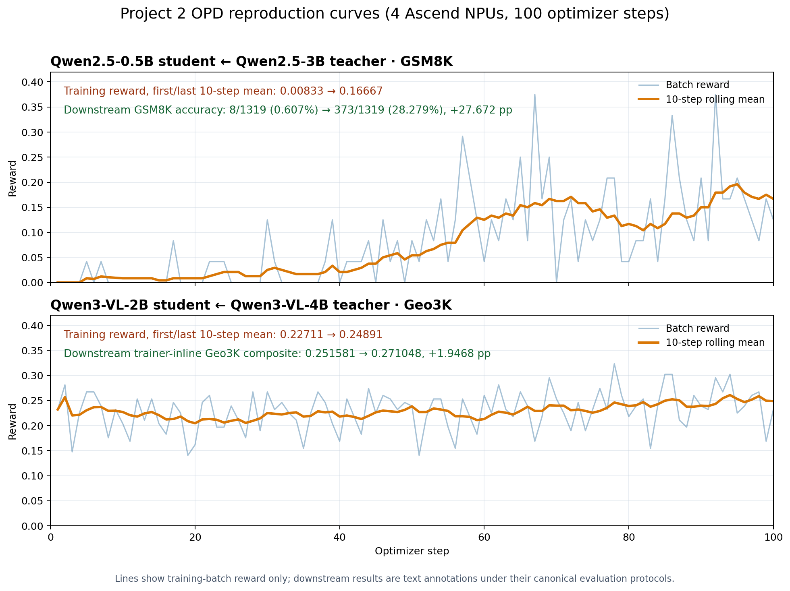

# 昇腾 NPU 上基于 Megatron 和 vLLM Ascend 的在线蒸馏 / On-policy distillation with Megatron and vLLM Ascend

更新日期 / Last updated: 2026-08-11.

## 中文版

本文介绍如何在昇腾 NPU 上使用 Megatron 训练后端和 vLLM Ascend 推理后端，
完成全参数在线蒸馏（OPD）。仓库提供以下标准脚本：

- `run_qwen2_5_0_5b_megatron.sh`：在 GSM8K 上使用
  Qwen2.5-3B-Instruct teacher 蒸馏 Qwen2.5-0.5B student。
- `run_qwen3_vl_megatron.sh`：可配置 Qwen3-VL student 和 teacher；默认模型为
  Qwen3-VL-4B-Instruct 和 Qwen3-VL-8B-Instruct。
- `run_qwen3_vl_2b_megatron.sh`：在 Geo3K 上使用官方对齐的
  Qwen3-VL-4B-Instruct teacher 蒸馏 Qwen3-VL-2B-Instruct student。
  这是项目 2 当前的校准与验收链路。

三个脚本都通过 `torch_npu` 自动识别 `DEVICE=gpu|npu`，并在脚本内部选择对应的
资源、显存、offload 与运行时配置；只有特殊环境才需要手工覆盖 `DEVICE`。脚本关闭
流水线并行和专家并行，并允许配置张量并行。每个资源池中未用于张量并行
的 worker 组成数据并行副本。四卡环境既支持 student/teacher 各 TP=2，也支持
物理 2+2、两侧 TP=1/DP=2。小模型不一定能从更大的 TP 获益，应以实测门禁选择。

### 软件兼容性

应使用 CANN、PyTorch、torch-npu、vLLM 与 vLLM Ascend 版本相互兼容的昇腾镜像，
不要在昇腾运行时上叠加面向 CUDA 的 verl 镜像。

启动 Ray 或 vLLM Ascend 前，需要同时加载 CANN 和 NNAL/ATB 环境。只加载 CANN
会导致 vLLM worker 在注册 ATB 扩展时找不到 `libatb.so`：

```bash
source /usr/local/Ascend/ascend-toolkit/set_env.sh
source /usr/local/Ascend/nnal/atb/set_env.sh
```

使用 `set -u` 的启动脚本在加载厂商环境脚本时，可能需要临时关闭 `nounset`。
如果 NNAL 把 ATB 示例或测试目录加入 `LD_LIBRARY_PATH`，并触发 `ld.so` TLS 分配
断言，可保留 NNAL 导出的变量，但只保留 ATB 运行库目录：

```bash
source /usr/local/Ascend/ascend-toolkit/set_env.sh
cann_ld_library_path=$LD_LIBRARY_PATH
source /usr/local/Ascend/nnal/atb/set_env.sh
export LD_LIBRARY_PATH="$ATB_HOME_PATH/lib:$cann_ld_library_path"
```

分配 NPU 前检查 ATB：

```bash
python - <<'PY'
import ctypes

ctypes.CDLL("libatb.so")
from torch_npu.op_plugin.atb._atb_ops import _register_atb_extensions

_register_atb_extensions()
print("ATB runtime is ready")
PY
```

四卡验收使用以下 CANN 9.0 软件栈。复现时应同时固定版本和源码 revision，避免
移动分支在版本号不变时引入行为变化。

| 组件 | 已验证版本或 revision |
| --- | --- |
| Python | 3.11.15 |
| PyTorch / torch-npu | 2.9.0 / 2.9.0 |
| vLLM | 0.18.0 (`bcf2be96120005e9aea171927f85055a6a5c0cf6`) |
| vLLM Ascend | 0.18.0 (`e18643f8a4d5bd9990727654318ad069ea0b56e2`) |
| triton-ascend | 3.2.1 |
| Ray | 2.56.1 |
| transformers | `cc7ab9be508ce6ed3637bba9e50367b29b742dc6` |
| Megatron Core | `core_r0.16.0` (`ddc0d6774783b032ddceacc5714e653651daecb9`) |
| MindSpeed | `core_r0.16.0` (`0bda3e134e1d8185b229d201b030757cdcb3ac36`) |
| mbridge | `a61943d7fcb34a190471cfeb0a0eb8bbda621ddf` |

该 vLLM Ascend 版本在 CANN 9.0 上要求 triton-ascend 3.2.1。3.2.0 虽可能正常
import，但存在编译器问题和 API 枚举不匹配。请用 `pip show triton-ascend`
核对 wheel；已验证的 3.2.1 wheel 内部仍可能报告 `triton.__version__ == "3.2.0"`。

Ascend Dockerfile 使用 `core_r0.16.0` 分支的 MindSpeed 和 Megatron Core，二者
应保持在同一 Megatron Core 版本线。本环境使用 legacy mbridge，因为 NVIDIA
Megatron-Bridge 会导入仅支持 CUDA 的 Transformer Engine 组件。

Dockerfile 保持安装发布版 `mbridge`，不固定源码 commit。Qwen3-VL 需要包含
`qwen3_vl` bridge 的 mbridge revision；在构建或启动 NPU 镜像后安装已验证版本：

```bash
pip install --no-deps \
  'git+https://github.com/ISEEKYAN/mbridge.git@a61943d7fcb34a190471cfeb0a0eb8bbda621ddf'
```

分配 NPU 前验证 bridge：

```bash
python - <<'PY'
from mbridge import AutoBridge

assert "qwen3_vl" in AutoBridge.list_supported_models()
PY
```

vLLM Ascend 0.18.0 的 batch-invariant linear 仅接受二维输入，而 Qwen3-VL profile
可能产生多前导维输入。默认训练未开启 full determinism，不受影响。严格评测需要
使用能展平并恢复这些维度的 revision，并随结果记录 revision 或 patch hash。

### 数据与模型

使用仓库工具准备 GSM8K：

```bash
python examples/data_preprocess/gsm8k.py \
  --local_save_dir "$HOME/data/gsm8k"
```

使用仓库工具准备 Geo3K：

```bash
python examples/data_preprocess/geo3k.py \
  --local_save_dir "$HOME/data/geo3k"
```

生成的 parquet 必须包含 `images` 列。图片可以字节形式存入 parquet；若保存的是
路径，则所有 Ray worker 都必须能访问相同路径。

脚本默认使用 Hugging Face 模型 ID。离线集群可把 `STUDENT_MODEL` 和
`TEACHER_MODEL` 指向本地快照。模型也可从 ModelScope 下载；快照落盘后无需修改
recipe。

### 启动方式

文本链路使用官方 `forward_kl_topk`、top-k 64 和直接监督蒸馏，不添加 task reward
或 policy-gradient 项：

```bash
ray stop --force
bash examples/on_policy_distillation_trainer/\
run_qwen2_5_0_5b_megatron.sh
```

默认使用两卡：student/rollout 与 teacher 各一卡，两侧 TP=1。GSM8K 默认 batch 12、
prompt 256、response 1024。四卡验收拓扑使用两侧 TP=2：

```bash
NGPUS_PER_NODE=2 \
TEACHER_WORLD_SIZE=2 \
ACTOR_TP=2 \
ROLLOUT_TP=2 \
TEACHER_TP=2 \
bash examples/on_policy_distillation_trainer/\
run_qwen2_5_0_5b_megatron.sh
```

这些 batch 和序列长度只是安全起点，不是可迁移的性能结论。应按模型组合、任务长度
分布和 HBM 容量重新调优。短 smoke test 可能未覆盖长尾 batch，长跑前应预留显存。

视觉语言链路使用官方 `k1` 定义作为 detached policy-gradient advantage：

```bash
ray stop --force
bash examples/on_policy_distillation_trainer/\
run_qwen3_vl_megatron.sh
```

对于 `k1` 等 reverse-KL estimator，当 rollout 或 teacher 可能对保留 token 给出零
概率时，应设置 `distillation.distillation_loss.log_prob_min_clamp`。student 和
teacher log-prob 会在 estimator 前对称 clamp，避免 `-inf - -inf` 进入优化 loss。

`rollout_corr/*` 是独立计算的原始诊断，仍可能出现 `inf` 或 `nan`。判断优化路径是否
稳定时，应检查有限的 `actor/distillation/loss`、`actor/loss` 和
`actor/grad_norm`，并单独披露原始诊断。

NPU 分支默认设置 `OPTIMIZER_CPU_OFFLOAD=true`，启用 Megatron CPU optimizer。
GPU 分支默认关闭该设置。CPU offload 仍会更新所有模型
参数；offload 只改变 optimizer state 的存放位置，不改变训练范围或可训练参数。

已验证 Geo3K 数据经 processor 展开后，训练 prompt 最大 771 token，测试最大 613
token，因此 1024 prompt 上限覆盖全部样本。多模态长度必须在图片/视频 token 展开后
统计；截断多模态 prompt 可能破坏 placeholder 与 feature 的对应关系，应视为配置错误。

两个基础脚本都默认训练 100 个 optimizer step，并关闭周期验证，以便 step 时间只覆盖
训练。需要验证时将 `TEST_FREQ` 设为正数。建议通过环境变量覆盖配置：

```bash
STUDENT_MODEL=/models/student \
TEACHER_MODEL=/models/teacher \
TRAIN_FILE=/data/train.parquet \
VAL_FILE=/data/test.parquet \
TRAIN_BATCH_SIZE=64 \
PPO_MINI_BATCH_SIZE=64 \
bash examples/on_policy_distillation_trainer/\
run_qwen2_5_0_5b_megatron.sh
```

`MAX_RESPONSE_LENGTH` 应按任务选择。response clip ratio 是诊断项，不是通用验收阈值；
OPD 仍会对保留的回复前缀提供 token 级监督。调整长度时应记录截断比例、检查样本并比较
固定下游评测，只有不降低所选 checkpoint 质量时才用短回复换取显存和吞吐。

长任务应在 tmux 等持久终端中启动，并将 Ray 临时目录、模型缓存、checkpoint 和日志
放在持久存储上。

### 调优顺序

每次只调整一个维度。比较吞吐前，应在 warmup 后至少保留十个稳态 step。

1. 确认 actor、rollout、teacher 使用预期的 NPU 拓扑，没有 worker 被放到错误资源池。
2. 增大 `TRAIN_BATCH_SIZE`，直到生成阶段保持连续 batching。
3. 增大 `PPO_MINI_BATCH_SIZE`，但不得超过 train batch size。
4. 增大 `PPO_MAX_TOKEN_LEN_PER_GPU` 以提高显存利用率；若长尾 batch OOM，则降低它。
   该预算独立控制 actor 与 log-prob microbatch，可降低峰值而不减少 rollout 并发。
5. 分别调整 rollout 和 teacher 的 memory utilization，为权重同步和多模态预处理留余量。
   测试必须覆盖多次 rollout sleep/wake，避免漏掉下一步唤醒时的显存峰值。
6. eager 模式成功后再启用 graph capture；其一次性启动成本不计入稳态吞吐。

端到端 global token throughput 定义为：

```text
全局 batch 中所有 prompt token 与生成 response token 之和
---------------------------------------------------------
                    optimizer step 墙钟时间
```

使用 trainer 的 `perf/total_num_tokens` 和 `perf/time_per_step`。该口径包含 rollout、
teacher 推理、log-prob、Megatron 前后向、optimizer update 和权重同步，不能用 vLLM
decode-only throughput 替代。`perf/throughput` 是单加速卡归一值，global TPS 应按上式计算。

### 官方模型组合与算法对齐

项目 2 的 Qwen3-VL 验收链路为：

```text
Qwen3-VL-2B-Instruct student <- Qwen3-VL-4B-Instruct teacher
```

使用 `run_qwen3_vl_2b_megatron.sh`，并对齐
[公开参考脚本](https://pages.doit.wisc.edu/DMAQBOOL/verl/-/blob/main/examples/on_policy_distillation_trainer/run_qwen3_vl_geo3k.sh)。
算法配置为 global batch 128、prompt 1024、response 2048、`k1`、top-k 64、
policy-gradient correction、关闭 task reward、rollout `n=1`、seed 42、固定数据顺序，
以及 `10/-10` log-prob clamp。

四卡验收只降级硬件拓扑：student 使用 NPU 0--1，teacher 使用 NPU 2--3，两侧均为
TP1/DP2。不得把 global batch 静默替换为早期 batch-12 smoke 配置。

四卡 20-step 校准任务
`opd-qwen3-vl-official-aligned-2b4b-batch128-response2048-20step-v6`
完成 20/20 step，trainer 和 orchestrator 均 exit 0。首末十步 reward 均值为
0.227109/0.204609，distillation loss 为 0.331285/0.262468，稳态 global TPS 为
1328.37。训练无 OOM、核心非有限值、运行时异常、actor death 或 worker restart，
step-20 checkpoint 通过完整性门禁。

step 0/5/10/15/20 的 trainer composite 分别为
0.251581/0.247088/0.251581/0.233611/0.251581。20 step 不是拒绝门禁；官方曲线波动
较大，收益约在 100 step 才明确，因此从 step-20 完整恢复到 100 step。

恢复任务完成 step 21--100，training 与 launcher exit 0。恢复段首末十步 reward 均值
为 0.225000/0.248906，distillation loss 从 0.268061 降至 0.207617，稳态 global TPS
为 1368.02。训练无 OOM、运行时异常、actor death、worker restart 或核心非有限值。

BF16 step-100 checkpoint 通过架构、2,127,532,032 参数、模型、7 个 optimizer shard
和 4 个 extra shard 门禁。trainer composite 从 step0 的 0.251581 上升至 step100 的
0.271048，即提升 1.9468 个百分点。该 composite 是正式下游指标，不应改称 raw accuracy；
独立固定配对实验只用于诊断。

### 完整训练日志

完整验收日志发布在同一个
[GitHub Gist](https://gist.github.com/egangu/4469135b55c9d0a73a4ad6d076ff2b34)。
Qwen3-VL 是一次 checkpoint-resume 链路，因此 step 1--20 和 21--100 分为两个文件。

- Qwen2.5 step 1--100：``58d03b33448b00384c7be15eb631d28b48c0a8f7966e792845c70cd3ca91fc89``
- Qwen3-VL step 1--20：``1077abae1deae12093d39fb26543f0556c36fdcf5b5d5d90199c2d5a258fa586``
- Qwen3-VL step 21--100：``04fa4f997ee1e37222863bc9edba0138157b0543068e56f24af549cf93290a1c``

### 四卡验收参考结果

在四张 Ascend 910B3 NPU 和上述 CANN 9.0 环境中，Qwen2.5 recipe 以 student TP=2、
teacher TP=2、global batch 24、response 1024 完成 100 个全参数 optimizer step。

排除 step 1 和 step 50/100 checkpoint 保存后，端到端 global TPS 均值为 223.41。
首末十步 reward 从 0.00833 上升至 0.16667，distillation loss 从 0.54703 降至
0.27079。固定 greedy GSM8K 评测从 step0 的 8/1319（0.61%）提升到 step100 的
373/1319（28.28%）。

下图以相同坐标和图例展示两条正式链路的 batch reward 与 10-step rolling mean；
下游结果仅作为文字标注，避免将 GSM8K accuracy 和 Geo3K trainer-inline composite
误画成同一种训练指标。


<div align="center">
 
</div>

这些数字是复现参考，不是可迁移硬件标杆。报告结果时应记录模型和数据 revision、
batch、token 上限、被排除 step 以及 checkpoint 评测设置。只在 100% 训练进度和
checkpoint 完整保存后出现的异常应单独记录为 teardown 行为，不能归入训练期失败。

### 正确性检查

长跑前应完成：

- 一步 eager smoke test；
- 确认 distillation loss 和 gradient norm 有限；
- 确认每个 optimizer step 只推进一次 `training/global_step`；
- 确认 student 与 teacher tokenizer 对相同 token ID 使用相同词表映射；chat template
  可以不同，因为 teacher 直接评分 student 渲染后的 token 序列；
- 对 Qwen3-VL 解码若干样本，确认图片已加载且 visual token 存在；
- 所有纯性能改动都应在固定短 batch 上比较改动前后的输出。

Megatron `forward_kl_topk` 是 vocabulary-parallel 实现。接受环境前，其 TP 下 loss
与梯度应和全词表参考实现一致。

### 已知限制

- Qwen3-VL mbridge 仍被上游标记为 experimental，应固定并测试 revision。
- 当前配置不覆盖流水线并行和专家并行；每种 TP/DP 拓扑都应独立验证。
- 两卡 TP=1 和四卡 TP=2 属于不同模型并行拓扑，不能直接外推吞吐。
- 启动耗时包含 Ray worker、模型转换和可选 graph capture；稳态 TPS 可排除它，但应
  单独记录运维启动时间。
- 单独的版本字符串不能保证兼容性；厂商镜像可能包含本地 patch，应随 benchmark
  记录包版本和依赖 commit。

---

## English Version


This guide covers full-parameter on-policy distillation (OPD) with Megatron
training and vLLM inference, including the vLLM Ascend path. The canonical
recipes are:

- `run_qwen2_5_0_5b_megatron.sh`: Qwen2.5-0.5B student and
  Qwen2.5-3B-Instruct teacher on GSM8K.
- `run_qwen3_vl_megatron.sh`: configurable Qwen3-VL student and teacher
  models; its defaults are Qwen3-VL-4B-Instruct and Qwen3-VL-8B-Instruct.
- `run_qwen3_vl_2b_megatron.sh`: the official-aligned
  Qwen3-VL-2B-Instruct student and Qwen3-VL-4B-Instruct teacher pair on
  Geo3K. This is the current project-2 calibration target.

All three scripts auto-detect `DEVICE=gpu|npu` by probing `torch_npu` and select
device-specific resource, memory, offload, and runtime settings internally.
Override `DEVICE` only for unusual environments. The recipes keep pipeline and
expert parallelism disabled. Tensor parallelism
is configurable; any remaining workers in a pool form data-parallel replicas.
Their basic single-node placement is one NPU for the colocated student/rollout
pool and one NPU for the teacher pool. On four NPUs, both a TP=2+2 placement
and a physical 2+2 placement with TP=1/DP=2 are supported. Select between them
with a measured gate rather than assuming that additional tensor parallelism
is faster for a small model.

### Software compatibility

Start from an Ascend image whose CANN, PyTorch, torch-npu, vLLM, and
vLLM Ascend versions are mutually compatible. Do not install a CUDA-focused
verl image on top of an Ascend runtime.

Load both the CANN and NNAL/ATB runtime environments before starting Ray or
vLLM Ascend. Loading CANN alone is insufficient: the vLLM worker fails while
registering its ATB extensions when `libatb.so` is not on the library path.
For the standard Ascend installation layout, run:

```bash
source /usr/local/Ascend/ascend-toolkit/set_env.sh
source /usr/local/Ascend/nnal/atb/set_env.sh
```

Launch wrappers that enable Bash `nounset` (`set -u`) may need to disable it
temporarily while sourcing vendor environment scripts, then enable it again.
Some NNAL releases also append ATB example and test directories to
`LD_LIBRARY_PATH`. If a Ray actor exits before processing its first request
with an `ld.so` TLS-allocation assertion, keep the variables exported by the
NNAL script but restrict the ATB library entry to its runtime directory:

```bash
source /usr/local/Ascend/ascend-toolkit/set_env.sh
cann_ld_library_path=$LD_LIBRARY_PATH
source /usr/local/Ascend/nnal/atb/set_env.sh
export LD_LIBRARY_PATH="$ATB_HOME_PATH/lib:$cann_ld_library_path"
```

Verify the runtime before allocating NPUs:

```bash
python - <<'PY'
import ctypes

ctypes.CDLL("libatb.so")
from torch_npu.op_plugin.atb._atb_ops import _register_atb_extensions

_register_atb_extensions()
print("ATB runtime is ready")
PY
```

The four-NPU acceptance runs used the following CANN 9.0 stack. Pin
source revisions as well as package versions when reproducing it; a moving
release branch can change without changing the displayed package version.

| Component | Validated version or revision |
| --- | --- |
| Python | 3.11.15 |
| PyTorch / torch-npu | 2.9.0 / 2.9.0 |
| vLLM | 0.18.0 (`bcf2be96120005e9aea171927f85055a6a5c0cf6`) |
| vLLM Ascend | 0.18.0 (`e18643f8a4d5bd9990727654318ad069ea0b56e2`) |
| triton-ascend | 3.2.1 |
| Ray | 2.56.1 |
| transformers | `cc7ab9be508ce6ed3637bba9e50367b29b742dc6` |
| Megatron Core | `core_r0.16.0` (`ddc0d6774783b032ddceacc5714e653651daecb9`) |
| MindSpeed | `core_r0.16.0` (`0bda3e134e1d8185b229d201b030757cdcb3ac36`) |
| mbridge | `a61943d7fcb34a190471cfeb0a0eb8bbda621ddf` |

CANN 9.0 requires triton-ascend 3.2.1 for this vLLM Ascend line. A 3.2.0
installation can import successfully but is not a valid substitute: it has
known compiler issues and an API enum mismatch in this stack. Confirm the
installed distribution with `pip show triton-ascend` rather than relying on a
transitive dependency declaration. The validated 3.2.1 distribution still
reports `triton.__version__ == "3.2.0"`, so libraries that inspect the module
attribute can emit a stale-version warning even though the installed wheel is
the required 3.2.1 build.

For CANN 9.0, the Ascend Dockerfiles in this repository use MindSpeed and
Megatron Core from their `core_r0.16.0` branches. Keep those two dependencies
on the same Megatron Core line. The legacy mbridge backend is selected because
the NVIDIA Megatron-Bridge package imports CUDA-only Transformer Engine
components in this environment.

The Dockerfiles retain the released `mbridge` package and do not pin a source
commit. Qwen3-VL support requires an mbridge revision containing the `qwen3_vl`
bridge. The recipes were validated with mbridge commit
`a61943d7fcb34a190471cfeb0a0eb8bbda621ddf`. The PyPI package named `0.15.1`
may not contain that bridge even though it has the same package version. Until
a newer mbridge release includes it, install the tested revision explicitly:

```bash
pip install --no-deps \
  'git+https://github.com/ISEEKYAN/mbridge.git@a61943d7fcb34a190471cfeb0a0eb8bbda621ddf'
```

Verify the bridge before allocating NPUs:

```bash
python - <<'PY'
from mbridge import AutoBridge

assert "qwen3_vl" in AutoBridge.list_supported_models()
PY
```

The vLLM Ascend 0.18.0 batch-invariant linear kernel accepts only 2D input,
while Qwen3-VL profiling can use multiple leading dimensions. This does not
affect the default recipes because full determinism is off. Strict evaluation
requires a revision that flattens and restores those dimensions; record the
revision or patch hash with the result.

### Data and models

Prepare GSM8K with the repository utility:

```bash
python examples/data_preprocess/gsm8k.py \
  --local_save_dir "$HOME/data/gsm8k"
```

Prepare Geo3K with the repository utility:

```bash
python examples/data_preprocess/geo3k.py \
  --local_save_dir "$HOME/data/geo3k"
```

The resulting parquet files must contain the `images` column. Images may be
embedded in the parquet as bytes; if a dataset stores paths instead, those
paths must be visible from every Ray worker.

Hugging Face model IDs are the defaults. For an offline cluster, set
`STUDENT_MODEL` and `TEACHER_MODEL` to local snapshot directories. ModelScope
can be used as the download source; no recipe changes are required after the
snapshots are stored locally.

### Launch

The text recipe uses the official `forward_kl_topk` loss with top-k 64 and
direct supervised distillation. It does not add a task-reward or policy-gradient
term:

```bash
ray stop --force
bash examples/on_policy_distillation_trainer/\
run_qwen2_5_0_5b_megatron.sh
```

The recipe defaults use two NPUs (one for student/rollout and one for the
teacher, TP=1 in each pool). The validated GSM8K defaults are batch 12, prompt
256, and response 1024, so the basic launch above needs no topology overrides.
To run the supplementary four-NPU topology, assign TP=2 to both pools:

```bash
NGPUS_PER_NODE=2 \
TEACHER_WORLD_SIZE=2 \
ACTOR_TP=2 \
ROLLOUT_TP=2 \
TEACHER_TP=2 \
bash examples/on_policy_distillation_trainer/\
run_qwen2_5_0_5b_megatron.sh
```

Treat these batch and sequence values as a safe starting point, not a portable
performance claim. Re-tune them for the model pair, task-length distribution,
and HBM capacity. A short probe can miss a later long-tail batch, so preserve
memory headroom before committing to a long run.

The vision-language recipe uses the official `k1` definition as a detached
policy-gradient advantage:

```bash
ray stop --force
bash examples/on_policy_distillation_trainer/\
run_qwen3_vl_megatron.sh
```

For reverse-KL estimators such as `k1`, set
`distillation.distillation_loss.log_prob_min_clamp` when the rollout or teacher
can assign exactly zero probability to a retained token. The clamp is applied
to both student and teacher log probabilities before evaluating the estimator,
preventing `-inf - -inf` from entering the optimized loss. Raw
`rollout_corr/*` diagnostics are computed independently and can still report
`inf` or `nan`; disclose those diagnostics separately and use the finite
`actor/distillation/loss`, `actor/loss`, and `actor/grad_norm` fields to decide
whether the optimization path is numerically valid.

The NPU branch defaults `OPTIMIZER_CPU_OFFLOAD=true`, selecting Megatron's
CPU-resident optimizer; the GPU branch defaults it to false. CPU offload still
updates every model parameter and changes optimizer-state placement rather
than the training scope or trainable parameters.

The processor-expanded Geo3K prompts in the validated dataset reached 771
tokens in train and 613 in test, so the 1024 prompt limit preserves every
sample. Size multimodal prompts after image/video token expansion rather than
from raw text alone. Unlike response clipping, truncating a multimodal prompt
can break placeholder-to-feature alignment and should be treated as a
configuration error.

Both recipes run 100 optimizer steps and disable periodic validation by default
so the reported step time covers training only. Set `TEST_FREQ` to a positive
value when validation is required. Override paths and batch sizes with
environment variables rather than editing the scripts:

```bash
STUDENT_MODEL=/models/student \
TEACHER_MODEL=/models/teacher \
TRAIN_FILE=/data/train.parquet \
VAL_FILE=/data/test.parquet \
TRAIN_BATCH_SIZE=64 \
PPO_MINI_BATCH_SIZE=64 \
bash examples/on_policy_distillation_trainer/\
run_qwen2_5_0_5b_megatron.sh
```

Choose `MAX_RESPONSE_LENGTH` for the task. The response clip ratio is a
diagnostic, not a universal quality or acceptance threshold: OPD still
supplies token-level supervision on the retained response prefix, and short
mathematical tasks can often use a shorter limit than open-ended generation.
Record the ratio and inspect clipped samples. A base student that repeats until
the limit is different from a dataset whose valid answers genuinely require
more context. Compare fixed downstream evaluations when changing the limit;
use a shorter setting for memory headroom and throughput only when it does not
degrade the selected checkpoint.

For long runs, launch in a persistent terminal such as tmux and keep Ray's
temporary directory, model caches, checkpoints, and logs on persistent storage.

### Tuning order

Tune one dimension at a time and retain at least ten steady-state steps after
warmup before comparing throughput.

1. Confirm that the actor, rollout, and teacher pools use the selected NPU
   topology and that no worker is placed on the wrong pool.
2. Increase `TRAIN_BATCH_SIZE` until generation is continuously batched.
3. Increase `PPO_MINI_BATCH_SIZE` while keeping it no larger than the train
   batch size.
4. Raise `PPO_MAX_TOKEN_LEN_PER_GPU` until memory is well utilized, then reduce
   it if long-tail batches cause out-of-memory failures. This budget controls
   dynamic actor and log-probability microbatching independently of the global
   train batch size, so reducing it can remove an activation or logits peak
   without reducing rollout concurrency.
5. Tune rollout and teacher memory utilization independently. Leave headroom
   for weight synchronization and multimodal preprocessing. Test enough steps
   to exercise repeated rollout sleep/wake transitions; a probe that ends
   immediately after an optimizer step can miss the next weight wake-up.
6. Enable graph capture only after an eager run succeeds. Graph capture has a
   significant one-time startup cost and should not be included in steady-state
   throughput comparisons.

The end-to-end global token throughput is:

```text
sum(prompt tokens + generated response tokens across the global batch)
-----------------------------------------------------------------------
                         optimizer-step wall time
```

Use the trainer's `perf/total_num_tokens` and `perf/time_per_step` metrics. This
definition includes rollout, teacher inference, log-probability computation,
Megatron forward/backward, optimizer update, and weight synchronization. Do not
report vLLM decode-only throughput as the end-to-end result. The trainer's
`perf/throughput` metric is normalized per accelerator, so calculate the ratio
above explicitly when reporting global throughput.

### Current official model-pair calibration

The project-2 target follows the official Qwen3-VL Geo3K OPD chain:

```text
Qwen3-VL-2B-Instruct student <- Qwen3-VL-4B-Instruct teacher
```

Use `run_qwen3_vl_2b_megatron.sh` for this calibration. It follows the
[public reference recipe](https://pages.doit.wisc.edu/DMAQBOOL/verl/-/blob/main/examples/on_policy_distillation_trainer/run_qwen3_vl_geo3k.sh):
global batch 128, a 1024-token prompt limit, a 2048-token response limit,
`k1`, top-k 64, policy-gradient correction, no task reward, rollout `n=1`,
seed 42, deterministic data order, and the `10/-10` log-probability clamps.
On the four-NPU acceptance host, only the hardware
topology is degraded from the public eight-NPU deployment: the student uses
NPU 0--1 and the teacher uses NPU 2--3, with TP1/DP2 on both sides. Do not
silently replace the global batch with the earlier batch-12 smoke setting.

The four-NPU 20-step calibration
`opd-qwen3-vl-official-aligned-2b4b-batch128-response2048-20step-v6`
completed 20/20 optimizer steps with trainer and orchestrator exit code 0.
The first/last ten-step reward means were 0.227109/0.204609 and the
distillation-loss means were 0.331285/0.262468. Steady global throughput was
1328.37 token/s after excluding the first and checkpoint steps. No training
OOM, non-finite optimized metric, runtime exception, actor death, or worker
restart occurred, and the step-20 checkpoint passed the model, optimizer, and
extra-state integrity gate.

The trainer-composite validation values at steps 0/5/10/15/20 were
0.251581/0.247088/0.251581/0.233611/0.251581.

This 20-step result is not a rejection gate. The first-party PR publishes a
high-variance Geo3K composite curve whose improvement becomes clear only near
100 steps. The validated step-20 model, optimizer, LR scheduler, RNG, and
dataloader state therefore seed a fresh resume-to-100 run. It preserves the
official five-step validation cadence and uses the trainer-inline composite at
step 0 and step 100 as the downstream acceptance metric.

The resume run completed optimizer steps 21--100 with training and launcher
exit code 0. The first/last ten resumed-step reward means were
0.225000/0.248906, and distillation loss decreased from 0.268061 to 0.207617.
Steady global throughput was 1368.02 token/s. No training OOM, runtime
exception, actor death, worker restart, or non-finite optimized metric was
found. The BF16 step-100 checkpoint passed the architecture, 2,127,532,032
parameter, model, seven-optimizer-shard, and four-extra-shard gates. Its
trainer-composite value was 0.271048 at step 100, after a noisy
0.244093--0.272546 range between steps 25 and 95. The matching trainer-inline
step-0 value was 0.251581, so the promoted downstream change is +1.9468
percentage points.

The acceptance metric is the trainer-inline Geo3K composite, reported directly
rather than relabeled as raw accuracy. Separate fixed-pair experiments are
diagnostic only and are not part of the promoted acceptance result.

### Complete training logs

The complete acceptance logs are published together in a public
[GitHub Gist](https://gist.github.com/egangu/4469135b55c9d0a73a4ad6d076ff2b34).
The Qwen3-VL run is one checkpoint-resume chain, so steps 1--20 and 21--100
are separate files. Verify downloaded files with these SHA256 digests:

- Qwen2.5 steps 1--100: ``58d03b33448b00384c7be15eb631d28b48c0a8f7966e792845c70cd3ca91fc89``
- Qwen3-VL steps 1--20: ``1077abae1deae12093d39fb26543f0556c36fdcf5b5d5d90199c2d5a258fa586``
- Qwen3-VL steps 21--100: ``04fa4f997ee1e37222863bc9edba0138157b0543068e56f24af549cf93290a1c``

### Validated four-NPU reference

On four Ascend 910B3 NPUs with the pinned CANN 9.0 environment above, the
Qwen2.5 recipe completed 100 full-parameter optimizer steps with student TP=2,
teacher TP=2, global batch 24, and a 1024-token response limit. Mean
end-to-end global throughput was 223.41 token/s after excluding step 1 and the
step 50/100 checkpoint-save steps. The first/last ten-step mean reward changed
from 0.00833 to 0.16667, and the corresponding distillation loss changed from
0.54703 to 0.27079. A fixed greedy GSM8K evaluation improved from 8/1319
(0.61%) at step 0 to 373/1319 (28.28%) at step 100.

The figure below uses the same axes and legend for both canonical chains. It
plots batch reward and its 10-step rolling mean; downstream results remain text
annotations so GSM8K accuracy and the Geo3K trainer-inline composite are not
misrepresented as the same training metric.


<div align="center">
 
</div>

Treat these numbers as a reproducibility reference rather than a portable
hardware benchmark. Report the exact model and data revisions, batch and token
limits, excluded steps, and checkpoint-evaluation settings with every result.
Warnings or exceptions emitted only after 100% training progress and complete
checkpoint creation should be recorded separately as teardown behavior; they
must not be silently grouped with training-phase failures.

### Correctness checks

Before a long run:

- run a one-step eager smoke test;
- confirm finite distillation loss and gradient norm;
- check that `training/global_step` advances exactly once per optimizer step;
- verify that student and teacher tokenizers map the same token IDs to the same
  vocabulary entries; different chat templates are acceptable because the
  teacher scores the student-rendered token sequence directly;
- for Qwen3-VL, inspect several decoded samples to confirm that images are
  loaded and visual tokens are present;
- compare a short fixed batch before and after any performance-only change.

The Megatron `forward_kl_topk` implementation is vocabulary-parallel. Its loss
and gradients should match the full-vocabulary reference under TP before an
environment is accepted for training.

### Known limitations

- The Qwen3-VL mbridge implementation is still marked experimental upstream.
  Pin and test the dependency instead of tracking its moving main branch.
- Pipeline and expert parallelism are not part of this configuration; TP and
  the resulting data-parallel replica count must be validated per topology.
- Two-NPU TP=1 and four-NPU TP=2 use different model-parallel topologies;
  validate both independently instead of extrapolating throughput between
  them.
- Startup time includes Ray worker creation, model conversion, and optional NPU
  graph capture. Exclude it from steady-state throughput, but record it
  separately when operational startup time matters.
- Version strings alone do not guarantee compatibility: some vendor images
  carry locally patched builds. Record package versions and dependency commit
  hashes with every benchmark.
