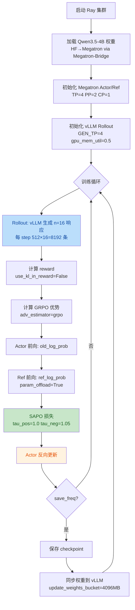
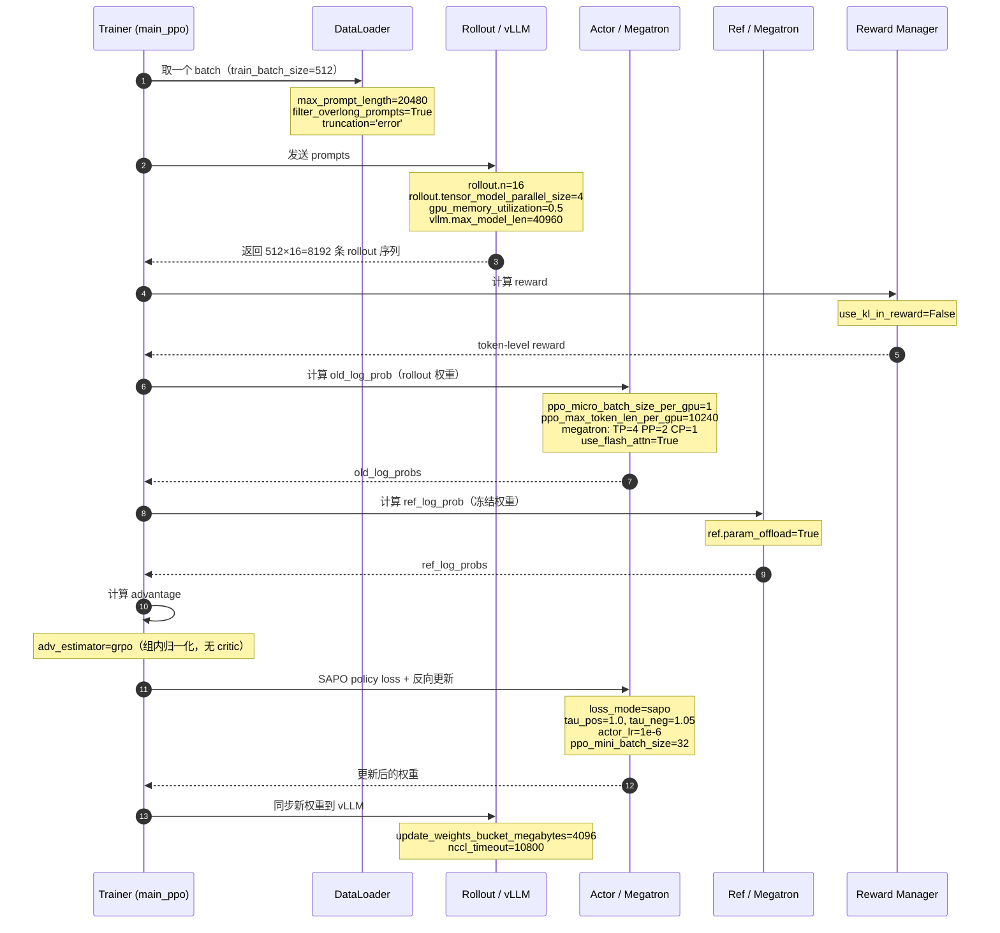

# NPU Qwen3.5-4B SAPO Megatron 训练实践

Last updated: 09/09/2026.

本实践对应的训练脚本：[run_qwen3_5_4b_megatron_npu.sh](../../../../../examples/ascend_extras/sapo_trainer/run_qwen3_5_4b_megatron_npu.sh)（`examples/ascend_extras/sapo_trainer/run_qwen3_5_4b_megatron_npu.sh`）。

## 背景

SAPO（Smooth Advantage PO）用平滑的 tau 参数化代理替代传统的比率裁剪（arXiv:2511.20347）。与 GRPO 相比，SAPO 通过非对称门控（`tau_pos` / `tau_neg`）对正负优势施加不同程度的正则化，在长链推理（long-CoT）场景下可缓解熵坍缩并提升训练稳定性。

本实践在 Ascend NPU 集群上使用 verl + Megatron + vLLM 对 Qwen3.5-4B dense 模型进行 SAPO 强化学习训练，验证分布式可用性。

## 算法配置

```bash
# 核心算法配置
algorithm.adv_estimator=grpo                  # 使用 GRPO 优势估计器
algorithm.use_kl_in_reward=False             # 不在奖励中添加 KL 惩罚

# SAPO 策略损失
actor_rollout_ref.actor.policy_loss.loss_mode=sapo
+actor_rollout_ref.actor.policy_loss.tau_pos=1.0   # 正优势门控
+actor_rollout_ref.actor.policy_loss.tau_neg=1.05  # 负优势门控（略大，对负优势更保守）

# KL 配置（SAPO 不使用 KL loss）
actor_rollout_ref.actor.use_kl_loss=False
actor_rollout_ref.actor.entropy_coeff=0
```

一般选择入口函数为 `verl.trainer.main_ppo`。完整可运行示例见上述脚本链接。

## Qwen3.5 架构约束（关键）

Qwen3.5 使用 **Gated Delta Net (GDN)** 线性注意力，当前在 Megatron-LM 中**不支持** packed sequences（THD 格式）。因此必须强制使用 **bshd** 计算格式，下列三项必须同时为 `False`：

- `model.use_remove_padding=False` — 模型层关闭 padding 移除，强制 bshd
- `actor.megatron.use_remove_padding=False` — Megatron actor 侧关闭 padding 移除
- `actor.use_dynamic_bsz=False` — bshd 模式下不能开动态 batch

> 待 Megatron-LM 为 Qwen3.5 GDN 添加 THD 支持后，可将 `use_remove_padding` 设为 `True` 以获得更好性能。

## 基础环境

当前支持 Atlas 800T A3 与 Atlas 900 A3 SuperPoD。

### 安装基础环境

| software      | version                                                    |
| ------------- | ---------------------------------------------------------- |
| Python        | 3.11                                                       |
| CANN          | ==9.0.0.B160 (CANN900B160)                                 |
| torch         | ==2.9.0                                                    |
| torch_npu     | ==2.9.0                                                    |
| triton_ascend | ==3.2.1                                                    |
| verl          | main                                                       |
| vllm          | v0.18.0                                                    |
| vllm-ascend   | v0.18.0                                                    |
| transformers  | 5.3.0                                                      |
| Megatron-LM   | 0.16.1                                                     |
| MindSpeed     | 0.16.0                                                     |
| Megatron-Bridge | `de93536e`                                               |

```bash
cd verl
git checkout main
git submodule update --init --recursive recipe
```

### 权重获取

```bash
hf download Qwen/Qwen3.5-4B --local-dir $HOME/verl/models/Qwen3.5-4B
```

### 数据集准备

```bash
# 下载 DAPO-Math-17k 训练数据集
git clone https://huggingface.co/datasets/BytedTsinghua-SIA/DAPO-Math-17k \
    $HOME/verl/datasets/dapo-math-17k

# 下载 AIME 2024 测试数据集
git clone https://huggingface.co/datasets/Maxwell-Jia/AIME_2024 \
    $HOME/verl/datasets/aime-2024
```

### Megatron-Bridge 安装

> **重要**：Docker 镜像中只装了已弃用的 `mbridge`（ISEEKYAN/mbridge，不支持 Qwen3.5），必须手动安装官方 `Megatron-Bridge`（NVIDIA-NeMo/Megatron-Bridge，已支持 Qwen3.5）。两者 import 名都是 `megatron_bridge`，极易混淆。

```bash
# 1. 卸载旧版（避免残留冲突——二者 import 名相同）
pip uninstall -y megatron-bridge megatron_bridge mbridge || true

# 2. 克隆官方仓库并切到脚本要求的 commit
git clone https://github.com/NVIDIA-NeMo/Megatron-Bridge.git /opt/megatron-bridge
cd /opt/megatron-bridge
git checkout de93536e

# 3. 开发模式安装
pip install -e .

# 4. 验证
python -c "import megatron_bridge; print(megatron_bridge.__version__)"
```

**verl 集成 Megatron-Core 的 3 种方式**：

| 方式 | 状态 | 配置 |
|---|---|---|
| #1 verl 内置逐模型转换 | 已弃用 | `use_mbridge=False`（v0.7 后移除） |
| #2 mbridge (ISEEKYAN/mbridge) | 将于 v0.8 弃用，不接受新模型 | `use_mbridge=True, vanilla_mbridge=True` |
| #3 Megatron-Bridge (NVIDIA-NeMo 官方) | **推荐**，已支持 Qwen3.5 | `use_mbridge=True, vanilla_mbridge=False` |

本脚本配置走方式 #3：`use_mbridge=True, vanilla_mbridge=False`。

### 额外依赖

```bash
pip install viztracer flash-linear-attention nvidia-modelopt nvidia-ml-py nvidia-resiliency-ext megatron-energon
```

- `flash-linear-attention` — Gated Delta Net (GDN) 线性注意力实现，Qwen3.5 必需。
- `megatron-energon` — Megatron 数据加载器。
- `viztracer` — 性能 trace 工具。

## 硬件和并行配置

示例脚本默认使用如下 NPU 配置（8 节点 128 NPU），可以通过同名环境变量覆盖：

| model | nnodes | devices per node | TP | PP | CP | EP | ETP | GEN_TP | DP |
| --- | --- | --- | --- | --- | --- | --- | --- | --- | --- |
| Qwen3.5-4B | 8 | 16 | 4 | 2 | 1 | 1 | 1 | 4 | 16 |

- **DP 计算**：`NNODES × NGPUS_PER_NODE / (TP × PP × CP) = 8 × 16 / (4×2×1) = 16`
- **约束**：`train_batch_size >= DP`（每个 DP rank 至少 1 个样本），脚本取 `train_batch_size=512`
- **GEN_TP=4**：vLLM rollout 侧张量并行，4 卡一组做生成，与 Megatron 共享显存（`gpu_memory_utilization=0.5`）

单节点配置示例（1 节点 8 NPUs）：

| model | nnodes | devices per node | TP | PP | CP | EP | ETP | GEN_TP | DP |
| --- | --- | --- | --- | --- | --- | --- | --- | --- | --- |
| Qwen3.5-4B | 1 | 8 | 4 | 2 | 1 | 1 | 1 | 8 | 1 |

## 关键训练参数

| 参数 | 取值 | 说明 |
|---|---|---|
| `train_batch_size` | 512 | 每 step 512 个 prompt |
| `rollout.n` | 16 | 每 prompt 采样 16 条（GRPO 组大小） |
| `ppo_mini_batch_size` | 32 | mini-batch 大小 |
| `max_prompt_length` | 20480 | prompt 上限 |
| `max_response_length` | 20480 | 响应上限 |
| `vllm.max_model_len` | 40960 | vLLM 最大序列长度 |
| `actor_lr` | 1e-6 | actor 学习率 |
| `tau_pos` / `tau_neg` | 1.0 / 1.05 | SAPO 非对称门控参数 |
| `entropy_coeff` | 0 | 熵正则 |
| `use_kl_loss` | False | loss 端无 KL |
| `use_kl_in_reward` | False | reward 端无 KL |
| `adv_estimator` | grpo | 组内归一化优势，无 critic |
| `loss_mode` | sapo | SAPO 策略损失 |
| `total_epochs` | 32 | 总 epoch |
| `save_freq` | 5 | 每 5 step 存 checkpoint |
| `test_freq` | 1000 | 每 1000 step 验证 |

**offload 与精度**（`ALL_OFFLOAD=True`）：

| 参数 | 取值 |
|---|---|
| `param_offload` | True |
| `optimizer_offload` | True |
| `grad_offload` | True |
| `optimizer_offload_fraction` | 1 |
| `overlap_cpu_optimizer_d2h_h2d` | True |
| `use_precision_aware_optimizer` | True |
| `optimizer_cpu_offload` | True |
| `dtype` | bfloat16 |

**transformer config override**：

| 参数 | 取值 |
|---|---|
| `attention_backend` | auto |
| `recompute_method` | uniform |
| `recompute_granularity` | full |
| `recompute_num_layers` | 1 |
| `use_flash_attn` | True |
| `use_naive_l2norm` | True |

> ⚠️ `use_naive_l2norm=True` 用朴素 L2 norm 替代 RMSNorm，在 20480 长序列下数值稳定性弱于 RMSNorm。如遇训练崩溃（权重 NaN），可排查此项。

## 训练流程



**单个 step 内数据交互时序**：



## 启动训练

训练前需要先启动 Ray 集群。通用多节点说明可参考 [Multinode Training](../../../../start/multinode.rst)。

```bash
# 1. 启动 Ray 集群（head 节点）
ray start --head --port 6766 --resources='{"NPU": 16}'
ray status

# 2. worker 节点加入（其余 7 节点分别执行）
ray start --address=<head_ip>:6766 --resources='{"NPU": 16}'

# 3. 启动训练
bash examples/ascend_extras/sapo_trainer/run_qwen3_5_4b_megatron_npu.sh
```

通过环境变量覆盖默认配置：

```bash
MODEL_PATH=/path/to/Qwen3.5-4B \
TRAIN_FILE=/path/to/train.parquet \
VAL_FILE=/path/to/val.parquet \
TP=4 PP=2 \
bash examples/ascend_extras/sapo_trainer/run_qwen3_5_4b_megatron_npu.sh
```

## 常见问题

### Q1: 镜像缺 Megatron-Bridge

#### 问题现象

启动训练时报错提示 **mbridge 不支持 Qwen3.5**。

#### 根因

Docker 镜像只装了 `mbridge`（ISEEKYAN/mbridge，已弃用、支持列表仅含 Qwen3/Qwen3-MoE，**不含 Qwen3.5**），**没有** `Megatron-Bridge`（NVIDIA-NeMo 官方，已支持 Qwen3.5）。verl 去找官方包找不到，回退命中已弃用的 mbridge，触发"不支持该模型"报错。

> 注意 `mbridge` 与 `Megatron-Bridge` 是**两个不同的包**，pip 包名一个是 `mbridge`、一个是 `megatron-bridge`，import 名都是 `megatron_bridge`，极易混淆。

#### 解决方案

手动安装官方 Megatron-Bridge，见上文 [Megatron-Bridge 安装](#megatron-bridge-安装) 小节。

### Q2: mstx.range_end 报错

#### 问题现象

训练不中断，但每个 worker 持续打印：

```
[ERROR] Call range_end failed. Exception: mstx.range_end() missing 1 required positional argument: 'range_id'
```

#### 根因

MindSpeed 对 `torch.cuda.nvtx.range_push/pop` 做了 NVTX→MSTX patch，但 `range_pop()`（0 参）被重定向到 `mstx.range_end(range_id)`（需 1 参），导致 TypeError。

| 原始 API | 参数数 | patch 目标 | 参数数 | 兼容？ |
|---|---|---|---|---|
| `nvtx.range_push(message)` | 1 必需 | `mstx.range_start(message, stream, domain)` | 1 必需 + 2 可选 | ✅ |
| `nvtx.range_pop()` | **0** | `mstx.range_end(range_id, domain)` | **1 必需** | ❌ |

#### 解决方案

把 MindSpeed 的两条 mstx patch 替换成 no-op wrapper：

> ⚠️ **不要直接注释 patch**。注释后 `torch.cuda.nvtx.range_push/pop` 会退回到 torch 的 stub，在非 CUDA 构建里会抛 `RuntimeError: NVTX functions not installed`。

```bash
# 容器内找到文件
REQUIREMENTS_FILE=$(python -c "import mindspeed.features_manager.megatron_basic.requirements_basic as m; print(m.__file__)")

# 替换成 no-op
sed -i "s|pm.register_patch('torch.cuda.nvtx.range_push', torch_npu.npu.mstx.range_start)|pm.register_patch('torch.cuda.nvtx.range_push', lambda *a, **k: None)|" "$REQUIREMENTS_FILE"
sed -i "s|pm.register_patch('torch.cuda.nvtx.range_pop', torch_npu.npu.mstx.range_end)|pm.register_patch('torch.cuda.nvtx.range_pop', lambda *a, **k: None)|" "$REQUIREMENTS_FILE"

# 验证
grep -n "nvtx" "$REQUIREMENTS_FILE"
```

替换后，任何对 `torch.cuda.nvtx.range_push/pop` 的调用都变 no-op，既不触发 mstx 缺参 ERROR，也不触发 torch stub 的 RuntimeError。

### Q3: Checkpoint global shape 不匹配

#### 问题现象

启动训练时抛出：

```
megatron.core.dist_checkpointing.core.CheckpointingException: Global shape mismatch for
loaded (torch.Size([1119331272])) and expected ((3362257868,)) tensor for key
optimizer.distributed.dp_group_idx_7.gbuf_idx_0.dtype_(torch.bfloat16, torch.bfloat16)
.bucket_idx_0.exp_avg
```

#### 根因

checkpoint 目录残留了旧配置（不同模型大小或不同并行度）的 checkpoint。verl 启动时自动从 `default_local_dir` 恢复 checkpoint，用旧模型的优化器状态去匹配新模型，global shape 不匹配。`actor.checkpoint.strict=False` **无法绕过**此错误——`_validate_global_shapes` 在 `strict` 检查之前就抛出异常。

#### 解决方案

删除或备份旧 checkpoint 目录后重新启动：

```bash
# 方案1：备份后删除旧 checkpoint
mv $HOME/verl/ckpts/verl_sapo_qwen3_5/qwen3_5_4b_vllm_sapo_megatron \
   $HOME/verl/ckpts/verl_sapo_qwen3_5/qwen3_5_4b_vllm_sapo_megatron.old

# 方案2：换一个全新的输出目录
export CKPTS_DIR=$HOME/verl/ckpts/verl_sapo_qwen3_5/v2
bash examples/ascend_extras/sapo_trainer/run_qwen3_5_4b_megatron_npu.sh
```

**预防**：切换 `MODEL_PATH`（不同模型大小）或更改并行度配置（TP/PP/CP）时，务必同步更换 checkpoint 目录，避免跨配置 resume。

### Q4: Megatron→vLLM 推理 tokenizer 报错

#### 问题现象

训练后用 vLLM 加载训练产物推理时报错：

```
ValueError: Tokenizer class TokenizersBackend does not exist or is not currently imported.
```

#### 根因

**transformers 大版本不兼容**（训练 5.x → 推理 4.x）。verl 的 model merger 在训练镜像内通过 `tokenizer.save_pretrained()` 保存 tokenizer。transformers 5.x 保存时往 `tokenizer_config.json` 写入 `"tokenizer_class": "TokenizersBackend"`（5.x 新增的统一后端类）。而推理镜像的 transformers 4.57.x 不存在 `TokenizersBackend` 类，vLLM 调用 `AutoTokenizer.from_pretrained()` 时找不到该类。

#### 解决方案

**升级推理镜像 transformers 到 5.x**：

```bash
pip install transformers==5.3.0
```

**预防**：训练与推理应使用同一 transformers 大版本。若训练镜像与推理镜像大版本不一致，merger 保存的 tokenizer 文件需在推理前用原始模型 tokenizer 覆盖或修复 `tokenizer_class` 字段。

## 注意事项

- 脚本会通过 `torch_npu` 自动检测 NPU 环境。
- Qwen3.5 的 Gated Delta Net 当前不使用 packed sequence，因此脚本中保持 `use_remove_padding=False` 和 `use_dynamic_bsz=False`。
- NPU 分支设置 `vanilla_mbridge=False`、`use_flash_attn=True`、`use_naive_l2norm=True` 等 Ascend 适配参数。
