# XR Chest GRPO — Design Doc

This doc captures every design decision for the first-milestone GRPO run on the
chest-XR dataset, starting from a Qwen3-VL-4B SFT checkpoint and training in
verl on 8xB200. Companion plan:
[`.cursor/plans/xr_grpo_with_qwen3-vl_23f6efea.plan.md`](../../.cursor/plans/xr_grpo_with_qwen3-vl_23f6efea.plan.md).

## Executive summary

- **Backbone**: SFT-finetuned Qwen3-VL-4B at
  `/mnt/nfs/home/michael/lf_outputs/qwen3vl/xr-qwen3vl-4b-full_all_lowres-seed42/checkpoint-6398`.
  Standard HF `Qwen3VLForConditionalGeneration` safetensors — vLLM and FSDP2
  load it natively, no `trust_remote_code`.
- **Data**: XR-chest study-grouped JSONL re-used from llama-factory
  (`xr_chest-v0_1_3-v4-*.jsonl`), converted to parquet with paths to the
  RAVE cache as images. Pixel-identical decode to llama-factory's
  `Qwen3VLRavePlugin`.
- **Algorithm**: GRPO (`algorithm.adv_estimator=grpo`, no critic).
- **Reward**: placeholder ROUGE-L vs ground-truth report. Same signature as
  the eventual RATE-backed reward (see Phase 2 below).
- **Testbed**: single node `b200-9`, 8xB200.

## Repo layout

```
verl/
  docs/xr_grpo.md                               <-- this doc
  recipe/xr_chest/
    prepare_xr_data.py                          offline parquet builder
    xr_dataset.py                               XRChestRLHFDataset
    reward_xr_report.py                         placeholder reward
    run_qwen3vl_4b_grpo.sh                      launcher
    README.md                                   quickstart
    tests/
      test_pixel_parity.py                      byte-parity vs lf Qwen3VLRavePlugin
```

## Data pipeline

### Source

`/mnt/nfs/home/michael/llama-factory-voio/data/xr_chest-v0_1_3-v4-{train,valid_mini,test}.jsonl`

Each JSONL row is a *study*, grouped by `study_id`, with a list of `series`
(one per XR view) and a free-text `report` (ground truth). Series reference
cache directories under `/data/cache/voio-segmed/rave/xr_chest/<series_id>/`
each holding a single `volume.mp4` (HEVC uint16 grayscale 1 frame).

### Parquet schema

Produced offline by `prepare_xr_data.py`:

| column         | type               | notes                                                                              |
|----------------|--------------------|------------------------------------------------------------------------------------|
| `data_source`  | `str`              | always `"xr_chest"` — reward_fn_key                                                |
| `prompt`       | `list[{role,content}]` | single user message; `<image>` placeholders one per series                     |
| `images`       | `list[str]`        | absolute paths to RAVE series dirs (not image files — `volume.mp4` inside)         |
| `ability`      | `str`              | `"report_gen"`                                                                     |
| `reward_model` | `{style,ground_truth}` | `{"style": "rule", "ground_truth": <full report text>}`                         |
| `extra_info`   | `{study_id,index,split}` | needed by phase-2 RATE reward to join on study_id                              |

We deliberately put paths (not PIL bytes) in `images` because:

1. The cache is local to each b200 node at `/data/cache/...` (hundreds of GB,
   decoded-bytes-in-parquet would be ~180GB and mostly redundant).
2. Pixel-level parity is easier to assert against llama-factory when the
   decode lives in one place (our `XRChestRLHFDataset._load_rave_image`).

### Prompt construction

Mirrors `VoioSegmedQwen3VLConverter` at
[converter.py:972-1036](../../llama-factory-voio/src/llamafactory/data/converter.py).
`max_images=3`, slice-count-descending sort (XR slice_count is always 1 so
order is stable), `strip_prompt_metadata=True`, no system prompt.

User content, with one `<image>` placeholder per series:

```
The following series are obtained from the study:

Series 1: <image> 

Series 2: <image> 


Write a radiology report for this study.
```

*(double blank line before the task phrase is intentional — it matches the
`user_content += "\n\n" + task_phrase` at converter.py:1023).*

**Task phrase**: single fixed `"Write a radiology report for this study."`
baked in at parquet-build time. Per-row randomization (as SFT does via
`random.choice(task_phrases)`) is avoided to keep GRPO rollout groups on a
deterministic prompt.

### Pixel-level decode

`XRChestRLHFDataset._load_rave_image(path)` is byte-identical to
`Qwen3VLRavePlugin._load_rave_image` at
[mm_plugin.py:1763-1776](../../llama-factory-voio/src/llamafactory/data/mm_plugin.py):

```python
mp4_path = os.path.join(path, "volume.mp4")
container = av.open(mp4_path)
stream = container.streams.video[0]
frame = next(container.decode(stream))
arr = frame.to_ndarray(format="gray16le")
container.close()

arr_f = arr.astype(np.float32) / 65535.0
arr_u8 = (arr_f * 255.0).clip(0, 255).astype(np.uint8)
return Image.fromarray(arr_u8, mode="L").convert("RGB")
```

`tests/test_pixel_parity.py` imports both functions and asserts
`np.array_equal(ours, theirs)` across 10 random train series. **Must pass
before any training run.**

### Dataset subclass

`verl/recipe/xr_chest/xr_dataset.py::XRChestRLHFDataset(RLHFDataset)`.

Two overrides — minimum surface area:

1. **`_build_messages(example, key)`**: replace any string path in
   `example["images"]` with a decoded `PIL.Image` before handing off to
   `super()._build_messages(...)`. Keeps the standard `<image>` placeholder
   substitution intact.
2. **`maybe_filter_out_long_prompts`**: skipped — we rely on offline
   filtering at parquet-build time (see below). This avoids re-implementing
   the processor length probe just to special-case paths-vs-PIL.

Mutation of `example[self.image_key]` happens on a shallow copy so the
dataframe isn't modified in place.

### Offline filtering

At parquet-build time we run a tokenizer/processor length probe using the
*actual* Qwen3-VL processor + `image_max_pixels=131072` against the prompt
for each study (using one probe image to get the vision token count, then
multiplying by `len(images)`). Rows whose resulting prompt length exceeds
`max_prompt_length=1024` are dropped with a counted warning. This removes
the long-tail and lets us keep `filter_overlong_prompts=False` at train
time (faster startup, no re-decode of 60k images at every run).

## Model + training

### Sequence + image budget (critical)

We match the SFT recipe that produced the checkpoint
([full_all_unlocked_lowres.yaml](../../llama-factory-voio/configs/pillar_mmvlm_configs/exp_xr_qwen3vl/full_all_unlocked_lowres.yaml)):

- `data.image_max_pixels=131072` (~121 vision tokens per XR image)
- `data.max_prompt_length=1024` (matches SFT `cutoff_len=1024`)
- `data.max_response_length=1024` (enough for long radiology reports)

Any deviation would shift the model off its SFT distribution and risk
rollout collapse.

### Rollout (vLLM)

- `actor_rollout_ref.rollout.name=vllm`
- `tensor_model_parallel_size=2` (4 parallel rollout workers on 8 GPUs)
- `enforce_eager=False`, `free_cache_engine=True`
- `+actor_rollout_ref.rollout.engine_kwargs.vllm.mm_processor_cache_gb=0` (matches verl Qwen3-VL examples)
- `gpu_memory_utilization=0.6`
- `enable_chunked_prefill=False`
- `n=4` rollouts per prompt

### Actor (FSDP2)

- `actor_rollout_ref.actor.strategy=fsdp2`
- `fsdp_config.reshard_after_forward=True`
- No param offload, no optimizer offload (8xB200 has 183GB each — fits).
- `model.enable_gradient_checkpointing=True`
- `model.use_remove_padding=True`
- `actor.freeze_vision_tower=True` — the SFT checkpoint already has XR
  grounding in the tower; leaving it frozen avoids needing to push vision
  gradients and saves memory.
- `actor.optim.lr=1e-6` (standard GRPO)
- `actor.use_kl_loss=True`, `kl_loss_coef=0.01`, `kl_loss_type=low_var_kl`
- `actor.entropy_coeff=0`
- `algorithm.use_kl_in_reward=False`

### Batch sizing

GRPO in verl reuses the PPO actor knobs (see
[run_qwen2_5_vl-7b_freeze_vision.sh](../examples/grpo_trainer/run_qwen2_5_vl-7b_freeze_vision.sh)):

- `data.train_batch_size=64` — prompts per step
- `actor_rollout_ref.rollout.n=4` — responses per prompt
- `actor_rollout_ref.actor.ppo_mini_batch_size=32` — optimizer-step batch
- `actor_rollout_ref.actor.ppo_micro_batch_size_per_gpu=2` — forward/backward chunk

Per-step math: 64 prompts × 4 rollouts = 256 responses; 2 optimizer updates
per step (256 / 32 / 4); ~16 micro-batches per GPU per update across 8 GPUs.

### Reference policy

- `actor_rollout_ref.ref.fsdp_config.param_offload=True` (ref policy sees
  forward-only traffic; offload is free)
- Same `use_remove_padding`, `log_prob_micro_batch_size_per_gpu=20`.

### Checkpointing + logging

- `trainer.logger=["console","wandb"]`
- `trainer.project_name=pillar-rl`
- `trainer.experiment_name=xr-chest-qwen3vl-4b-grpo-<tag>`
- `trainer.save_freq=20`, `trainer.test_freq=10`, `total_epochs=1` (smoke).
- `trainer.val_before_train=True` to get a sanity val at step 0.

## Reward

### Placeholder: ROUGE-L

`verl/recipe/xr_chest/reward_xr_report.py::compute_score(...)`:

```python
def compute_score(
    data_source: str,
    solution_str: str,
    ground_truth: str,
    extra_info: dict | None = None,
) -> float:
    ...
```

Returns ROUGE-L F-measure in `[0, 1]`. This is a weak signal on radiology
text but non-trivial — good enough to see rollouts differentiate.
Hook: `custom_reward_function.path=verl/recipe/xr_chest/reward_xr_report.py`,
`custom_reward_function.name=compute_score`, `reward_manager.name=naive`,
`data.reward_fn_key=data_source`.

### Phase 2 plan: RATE-based reward

Follow the eval stack at
[llama-factory-voio/experiment_docs/eval_stack.md](../../llama-factory-voio/experiment_docs/eval_stack.md).

The reward function will:

1. At reward-worker startup, load pre-computed GT `questions.csv`
   (`~/lf_outputs/rate/v0.1.3/gt/xr_chest_valid_10k/questions.csv` or the
   train-set equivalent) into a `study_id -> {question -> Y/N}` dict.
2. For each rollout, POST `solution_str` to a persistent sglang server
   (Qwen3-30B-A3B-FP8) running the RATE pipeline stages 3+4 ("map-categories",
   "process-questions") in a single combined endpoint.
3. Join extracted per-question Y/N against GT on `extra_info["study_id"]`.
4. Return a scalar reward (recall or F1 across the 50 standardized
   questions, TBD).

The existing placeholder's signature is identical to what step 3 needs, so
swapping the reward module will be a 1-file change plus running the sglang
server.

## High-level data flow

```mermaid
flowchart LR
    subgraph Prep["Offline: prepare_xr_data.py"]
        JSONL[xr_chest-v0_1_3-v4 JSONL]
        JSONL --> Phrase["Append fixed phrase: Write a radiology report for this study."]
        Phrase --> Filter["Length filter vs image_max_pixels=131072"]
        Filter --> Parquet["{train,valid_mini,train_mini}.parquet"]
    end
    subgraph Runtime["Runtime: verl GRPO"]
        Parquet --> XRDS[XRChestRLHFDataset]
        XRDS -->|decode volume.mp4| PIL[PIL RGB uint8]
        PIL --> Proc[Qwen3-VL processor]
        Proc --> Rollout[vLLM rollout n=4]
        Rollout --> Reward[compute_score ROUGE-L placeholder]
        Reward --> GRPO[FSDP2 actor update]
    end
```



## Explicitly deferred

### Custom backbones (Atlas + Qwen3, DINOv2 + Qwen3)

Neither vLLM nor SGLang has a native architecture for
`PillarMMVLMLlavaForConditionalGeneration`. Options:

1. **verl `hf` rollout**. Works today, but transformers-level generate is
   ~5-10x slower than vLLM. Fine for smoke runs, not for scale.
2. **vLLM custom architecture plugin**. Non-trivial — requires registering
   the model class with vLLM's `ModelRegistry`, implementing custom
   weight-loading for the vision tower + projector, and a forward that
   matches vLLM's input-processing contract. Order-of-days of work.

Data decode for these backbones is already factored out in
`Qwen3VLRavePlugin` / `PillarMMVLMPlugin._load_xr_image` /
`_load_xr_volume` — so any future implementation will plug into the same
`XRChestRLHFDataset._load_rave_image` contract by adding
`_load_rave_xr_volume` and `_load_rave_xr_image_dinov2` variants and
branching on the backbone name.

### RATE-backed reward

See "Phase 2 plan" above.

### Multi-node training

Single-node for now. `trainer.nnodes` in the launcher is parametrized; flip
to N>1 with an appropriate ray/torchrun setup.

## Implementation log

### Data prep (done)

Run on `b200-9` (RAVE cache is local there at `/data/cache/voio-segmed/rave/xr_chest`):

```bash
ssh b200-9
cd /mnt/nfs/home/michael/verl
.venv/bin/python recipe/xr_chest/prepare_xr_data.py --verify-paths
```

Output row counts:

| Split       | Rows    | Path                                                  |
|-------------|---------|-------------------------------------------------------|
| train       | 818,689 | `~/data/xr_chest_grpo/train.parquet`                  |
| valid_mini  | 500     | `~/data/xr_chest_grpo/valid_mini.parquet`             |
| test        | 102,179 | `~/data/xr_chest_grpo/test.parquet` (unused in GRPO)  |
| train_mini  | 32      | `~/data/xr_chest_grpo/train_mini.parquet`             |

Zero rows dropped (no `no-series`, no `missing-paths`). `prepare_xr_data.py`
writes directly to NFS so all nodes see the same parquets.

### Pixel-parity test (done)

```bash
.venv/bin/python -m pytest recipe/xr_chest/tests/test_pixel_parity.py -v
```

**10/10 passed.** `load_rave_image` returns an ndarray byte-equal to
`llamafactory.data.mm_plugin.Qwen3VLRavePlugin._load_rave_image` for 10
randomly sampled XR series. Any future change to the decode path must
keep this test green.

### Environment setup (done)

Cross-node rule: the uv-managed Python must live on NFS so that `b200-9`
and `b200-17` resolve the same `.venv/bin/python` symlink.

```bash
# One-time, from any node:
uv python install 3.12.1          # installs to ~/.local/share/uv/python on NFS
cd ~/verl
uv venv .venv --python /mnt/nfs/home/michael/.local/share/uv/python/cpython-3.12.1-linux-x86_64-gnu/bin/python3.12
source .venv/bin/activate
uv pip install -e ".[vllm,geo]" rouge-score av ninja
uv pip install flash-attn --no-build-isolation
```

Extras beyond what verl's `[vllm,geo]` pulls in:
- **`rouge-score`** — placeholder reward.
- **`av`** — HEVC decoding of `volume.mp4`.
- **`ninja`** — required by vLLM's cuda-graph compilation at rollout
  time. Must be on `PATH` when Ray spawns workers.
- **`flash-attn`** — installed per `~/AGENTS.md` rule (no build isolation
  so it links against the already-installed torch).

**Gotcha — must activate venv before running the launcher.** Ray inherits
`PATH` from the launching shell; if the venv isn't activated, vLLM workers
fall back to system `python3` and can't find `ninja`. From b200-9:

```bash
source /mnt/nfs/home/michael/verl/.venv/bin/activate
cd /mnt/nfs/home/michael/verl
SMOKE=1 bash recipe/xr_chest/run_qwen3vl_4b_grpo.sh
```

The launcher also honors a `PYBIN` override in case someone wants to point
at a different interpreter without activating.

### Custom-class loading gotcha

verl's `load_extern_object` imports `data.custom_cls.path` via
`importlib.util.spec_from_file_location`, which loads the file as a
standalone module (not a package). **Relative imports do not resolve.**
`recipe/xr_chest/xr_dataset.py` therefore uses an absolute import
(`from recipe.xr_chest.rave_decode import load_rave_image`) which works
because the cwd (repo root) is on `sys.path` at launch time.

### Launcher SMOKE mode adjustment

`train_batch_size=64` with `train_mini` (32 rows) produces an empty
dataloader (verl asserts `len(dataloader) >= 1` and drops the tail by
default). The launcher now overrides to `TRAIN_BATCH_SIZE=8` /
`PPO_MINI_BATCH_SIZE=8` under `SMOKE=1` so one full step executes. Full
runs keep 64 / 32.

### Known non-fatal warnings

- `The tokenizer you are loading from ... with an incorrect regex pattern
  ... fix_mistral_regex=True`. Transformers warns on Qwen3-VL's tokenizer
  because a recent HF release uses a new regex form; the checkpoint's
  tokenization still works correctly and matches SFT. Ignore for now.
- `UserWarning: NPU not support router replay for now.` — verl's mindspeed
  shim warning. Irrelevant on B200s.

### Smoke status

In progress. Last observed progression:

- Hydra config validation: **passes**.
- Parquet load + `XRChestRLHFDataset` instantiation: **passes**
  (train_mini=32, valid_mini=500).
- Model/tokenizer load from SFT checkpoint: **passes**.
- vLLM engine init with `ninja` on PATH: pending verification.
- First GRPO step + reward > 0: pending.

The smoke run itself is cheap (train_mini × 1 epoch × batch 8 with
`rollout.n=4` ⇒ 4 optimizer steps after val_before_train). Once it
finishes cleanly we move to full-train runs and — in parallel — wire the
phase-2 RATE reward.

## Open questions (tracked as we implement)

_None right now — will be appended here if anything comes up during
implementation and requires user input._
