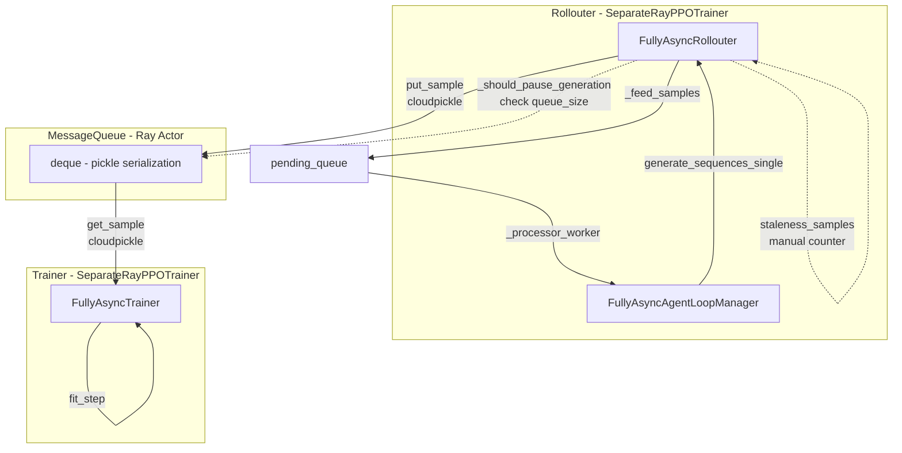
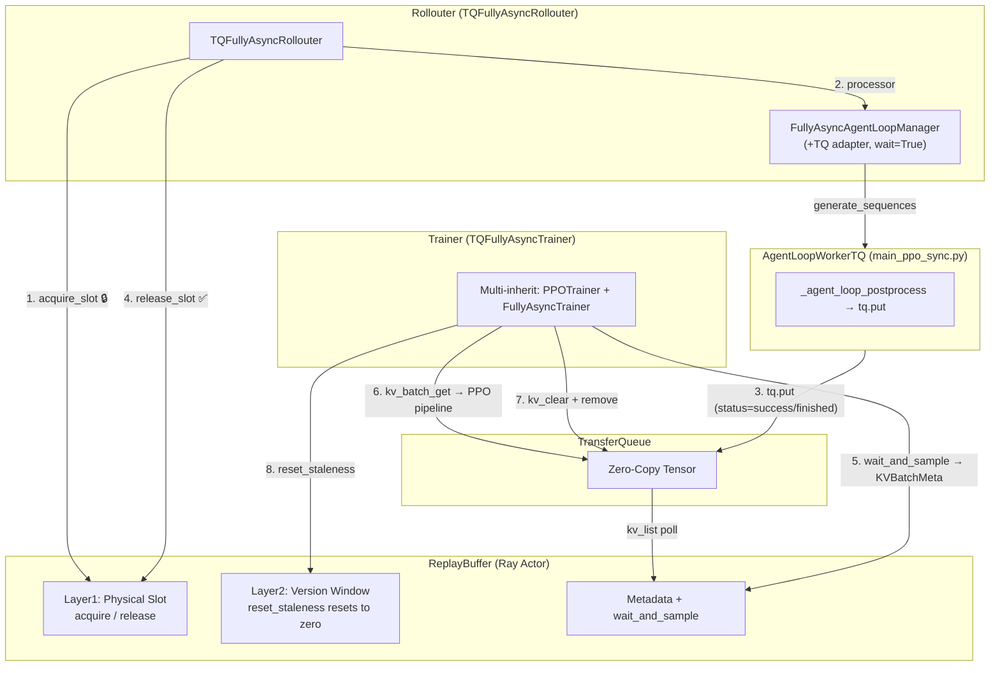
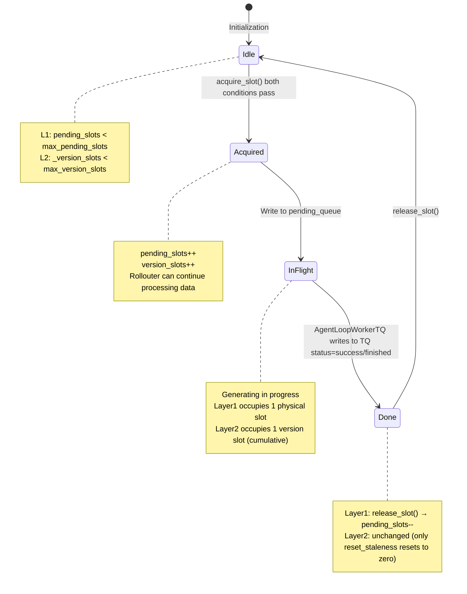
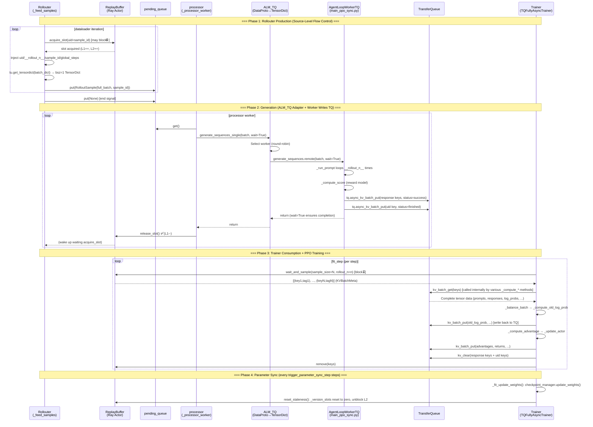

# Fully Async Policy with TransferQueue (TQ)

## Overview

This solution builds upon `fully_async_policy` by migrating the data transport channel from Ray **MessageQueue** to **TransferQueue (TQ)**,
while the training side reuses `main_ppo_sync.py`'s `PPOTrainer` via **multiple inheritance** to directly leverage TQ's native `KVBatchMeta` training pipeline.

### Core Design Principles

1. **Minimal Changes**: Keep `FullyAsyncAgentLoopManager` intact, preserving existing inference generation logic; only adapt lightly via `FullyAsyncAgentLoopManagerTQ`
2. **ReplayBuffer Flow Control**: Replace the original `_should_pause_generation` with ReplayBuffer (Ray Actor)'s Dual-Layer Slot mechanism
3. **TQ Replaces MessageQueue**: Data flows through TQ's zero-copy channel, metadata through ReplayBuffer
4. **Trainer Multiple Inheritance from PPOTrainer**: Reuse the TQ training pipeline via `class FullyAsyncTrainerTQ(PPOTrainer, FullyAsyncTrainer)`

### Core Objectives

1. **Zero-Copy Transport**: Use TQ instead of MessageQueue to avoid `ray.cloudpickle` serialization overhead
2. **Source-Level Flow Control**: Control production speed at dataloader data fetch (`_feed_samples`) via `acquire_slot()`
3. **Backpressure**: Dual-Layer Slot mechanism limits in-flight requests, eliminating the need for additional pause/resume logic
4. **Reuse Mature Code**: Trainer side uses multiple inheritance from PPOTrainer, directly using TQ's native batch training pipeline (`_compute_old_log_prob`, `_compute_advantage`, etc.)

## Architecture Comparison

### Existing Architecture (MessageQueue + SeparateRayPPOTrainer)



**Problems**:

- Full data `ray.cloudpickle` serialization/deserialization overhead is significant
- Ray Actor single-point bottleneck (MessageQueue)
- `_should_pause_generation` pause logic is complex (drain → resume)
- Trainer (`SeparateRayPPOTrainer`) differs greatly from colocate training pipeline, requiring maintenance of two codebases

### New Architecture (TQ + ReplayBuffer + PPOTrainer Multiple Inheritance)



**Core Changes**:

| Dimension | Existing Architecture | New Architecture |
|----------------------|------------------------------------------------|---------------------------------------------|
| **Data Channel** | MessageQueue (pickle) | TransferQueue (zero-copy) |
| **Metadata Channel** | None (mixed with data) | ReplayBuffer (Ray Actor) |
| **Flow Control** | `_should_pause_generation` + staleness_samples | `acquire_slot()` at `_feed_samples` source-level control |
| **Trainer Base Class** | `SeparateRayPPOTrainer` | `PPOTrainer` × `FullyAsyncTrainer` multiple inheritance |
| **Data Writer** | Rollouter._process_single_sample_streaming | `AgentLoopWorkerTQ._agent_loop_postprocess` |
| **AgentLoopManager** | `FullyAsyncAgentLoopManager` | `FullyAsyncAgentLoopManagerTQ` (lightweight subclass) |
| **Pause/Resume Logic** | paused + drain + resume | **Not needed** (slot blocking = flow control) |

## Core Components

### 1. ReplayBuffer (Ray Actor) — Metadata Channel + Dual-Layer Slot Flow Control

File: [`replay_buffer.py`](replay_buffer.py)

A lightweight Ray Actor that simultaneously handles **metadata storage** and **Dual-Layer Slot flow control**.

```python
@ray.remote(max_concurrency=100)
class ReplayBuffer:
    """Ray Actor: metadata channel + slot-based flow control for TQ fully async training.

    Replaces MessageQueue (data channel) in the original fully_async_policy.
    Key responsibilities:
    1. Dual-Layer slot backpressure: acquire_slot() blocks rollouter at dataloader source
    2. Metadata storage: tracks status of each sample via TQ kv_list polling
    3. Consumer interface: wait_and_sample() for trainer to get finished samples
    4. Version tracking: reset_staleness() for parameter sync coordination
    """

    def __init__(
            self,
            max_version_slots: int,  # Layer 2: staleness control
            max_pending_slots: int = 256,  # Layer 1: physical throttling
            poll_interval: float = 1.0,
    ):
```

#### Dual-Layer Slot Control Mechanism

`acquire_slot()` is the **single gatekeeping interface** between Rollouter and RB, simultaneously handling two responsibilities:

```
┌──────────────────────────────────────────────────────────────────────┐
│                    acquire_slot() Dual-Condition Check                │
│                                                                      │
│  Layer 1: Physical (Physical Throttling / OOM Protection)             │
│    Condition: _pending_slots < max_pending_slots                      │
│    Source: max_concurrent_samples (e.g., TP×PP×16)                    │
│    Purpose: Prevent OOM / GPU overload                                │
│    Release: release_slot() (called after Rollouter writes to TQ)      │
│                                                                      │
│  Layer 2: Version Window (Staleness Control / Stale Sample Protection)│
│    Condition: _version_slots < max_version_slots                      │
│    Source: required_samples × trigger_parameter_sync_step             │
│    Purpose: Prevent samples from having overly stale parameter versions│
│    Release: reset_staleness() resets to zero (called after Trainer   │
│             parameter sync)                                           │
│                                                                      │
│  ✅ Both conditions met → Grant slot (_pending_slots++, _version_slots++) │
│  ❌ Either condition fails → Block and wait                           │
└──────────────────────────────────────────────────────────────────────┘
```

State Transition:



#### Core Interfaces

| Interface | Caller | Description |
|---------------------------------------------------------|--------------------------------------------|-------------------------------|
| `acquire_slot(timeout, uid)` | Rollouter._feed_samples | Acquire a write slot (blocking, dual-condition check) |
| `release_slot()` | Rollouter._process_single_sample_streaming | Release physical slot |
| `wait_and_sample(partition_id, sample_size, rollout_n)` | Trainer._get_keys_from_rb | Block until enough finished samples are available |
| `remove(partition_id, keys)` | Trainer._cleanup_batch | Remove metadata for consumed samples |
| `reset_staleness()` | Trainer._fit_reset_staleness | Reset version window after parameter sync, zero out _version_slots |
| `signal_finish()` | Rollouter._streaming_generation_main | Signal end of production |

#### Background Tasks

- **`_poll_from_tq()`**: Periodically polls `tq.kv_list()` to get a global TQ snapshot, atomically replacing `self.partitions`. Includes UID integrity check: detects orphan keys (meta.uid doesn't match key prefix) and auto-cleans them.
- **`_monitor_loop()`**: Prints buffer statistics every 60 seconds.

#### Usage Pattern

```python
# Rollouter side (inside Ray Actor, async)
acquired = await asyncio.wrap_future(self.replay_buffer.acquire_slot.remote(timeout=None, uid=sample_id).future())

# Trainer side (inside Ray Actor, async)
sampled_keys_meta = await self.replay_buffer.sample.remote(
    partition_id="train", sample_size=N, rollout_n=n
)
```

---

### 2. FullyAsyncAgentLoopManagerTQ — AgentLoop Lightweight Adapter

File: [`fully_async_rollouter_tq.py`](fully_async_rollouter_tq.py)

**Key Points**:

- Worker class changed from default to `AgentLoopWorkerTQ` (defined in `main_ppo_sync.py`)
- `generate_sequences_single` adds `wait=True`: ensures Rollouter knows when generation completes, avoiding deadlocks
- `AgentLoopWorkerTQ._agent_loop_postprocess` directly writes results to TQ (`tq.async_kv_batch_put`), does not return data to Rollouter

**Lifecycle after writing to TQ**:

1. `AgentLoopWorkerTQ` writes `{uid}_{session_id}_{index}` response keys (status=success)
2. `AgentLoopWorkerTQ` writes `{uid}` uid-level key (status=finished)
3. ReplayBuffer `_poll_from_tq` discovers new keys via `tq.kv_list()`, updates `self.partitions`
4. ReplayBuffer `wait_and_sample` detects enough finished uids, returns to Trainer
5. Trainer reads complete data via `tq.kv_batch_get`, executes PPO training
6. After Trainer finishes training, `tq.kv_clear` + `rb.remove` cleanup

---

### 3. TQFullyAsyncRollouter — Rollouter Adapter

File: [`fully_async_rollouter_tq.py`](fully_async_rollouter_tq.py)

An incremental modification subclass based on `FullyAsyncRollouter`. Core changes are concentrated in three areas: data feeding, sample processing, and validation.

#### 3.1 `_feed_samples` — Source-Level Flow Control

**Key Differences from Base Class**:

- No longer calls `prepare_single_generation_data()` (no repeat(n)), instead injects `__rollout_n__` field so that `AgentLoopWorkerTQ._run_prompt` loops n times internally
- `batch_size=1` (bsz=1), each prompt processed individually
- `uid`/`__rollout_n__`/`sample_id`/`global_steps` injected as `np.array` into plain dict, becoming `NonTensorStack` after `tu.get_tensordict()`

#### 3.2 `_process_single_sample_streaming` — Simplified to generate + release

**Core Difference from Base Class**: The base class needs to manually put generation results to MessageQueue; in the TQ path, data writing is handled by `AgentLoopWorkerTQ._agent_loop_postprocess`, so Rollouter only needs to call generate then release_slot.

#### 3.3 Deleted/Disabled Methods

| Method | Handling | Reason |
|-------------------------------|------------|-----------------------------------|
| `_should_pause_generation()` | Returns `False` | Replaced by `acquire_slot` |
| `_async_monitor_loop()` | Empty implementation | Monitoring handled by ReplayBuffer._monitor_loop |

#### 3.4 Validation Flow `_validate`

Overrides base class validation method, using TQ + ReplayBuffer path.

---

### 4. TQFullyAsyncTrainer — Multi-Inheritance Trainer

File: [`fully_async_trainer_tq.py`](fully_async_trainer_tq.py)

**The most core design decision**: Use Python multiple inheritance `class FullyAsyncTrainerTQ(PPOTrainer, FullyAsyncTrainer)` to gain capabilities from both sides:

```python
"""
MRO: TQFullyAsyncTrainer → PPOTrainer → FullyAsyncTrainer → SeparateRayPPOTrainer → ...

Data flow:
    TQFullyAsyncRollouter --(tq.kv_batch_put)--> TransferQueue (status=finish)
        |
    TQFullyAsyncTrainer <-(RB.wait_and_sample)--+--(KVBatchMeta)--> [PPOTrainer pipeline]
                                                    |
                                              update_actor(KVBatchMeta)
"""
```

---

## Data Flow Details

### Complete Lifecycle Sequence Diagram



### Dual-Layer Slot Control Detailed Semantics

| Original Concept (MessageQueue Path) | New Implementation (TQ Path) |
|-------------------------------|-------------------------------------|
| `MessageQueue.queue_size` | `RB._pending_slots` (Layer 1: Physical Throttling) |
| `max_queue_size` | `max_pending_slots` (Layer 1) |
| `_should_pause_generation()` | **Removed** — `acquire_slot()` dual-condition = flow control |
| `staleness_samples` (manual counter) | `RB._version_slots` (Layer 2: Cumulative Counter) |
| `max_required_samples` | `max_version_slots` (Layer 2) |
| `paused` + `drain` + `resume` | **Preserved but no longer triggers throttling** — only used for safe drain during parameter sync |

**Before vs After Comparison**:

```
Before (Dual Throttling, Complex State Machine):
  1. _should_pause_generation(): queue_size >= max_queue_size → pause
  2. _should_pause_generation(): staleness_samples >= max_required_samples → pause
  → Need paused/drain/resume state machine

After (acquire_slot Single Interface, Dual Conditions):
  1. _feed_samples(): acquire_slot()
     → Layer 1 not met? block (physically full)
     → Layer 2 not met? block (version window full, wait for reset_staleness)
     → Both met? proceed
  → Clean token-bucket semantics, no extra state machine needed
```

**Parameter Sync Flow**:

```
Trainer.fit_step:
  1. wait_and_sample(batch_size) → get finished samples from RB
  2. ... PPO training pipeline (_compute_* / _update_*) ...
  3. update_weights() → NCCL sync weights to Rollouter GPUs
  4. reset_staleness():
       a. _version_slots = _pending_slots + train_finished_slots (recalculate)
       b. Reset timers (step_start_time, idle_start_time)
       c. Notify _slot_available → unblock acquire_slot's Layer 2
```

## Usage

### Launch Script Example

Key configuration points:

```bash
# ====== Required fully_async configuration ======
fully_async=(
  data.train_batch_size=0                 # Invalid in TQ mode, defaults to 0
  data.gen_batch_size=1                   # Streaming item-by-item generation
  trainer.test_freq=-1                     # Validation handled by rollouter
  actor_rollout_ref.hybrid_engine=False    # Decoupled architecture
  actor_rollout_ref.rollout.calculate_log_probs=True  # Use rollout log_prob
  rollout.total_rollout_steps=$(((512*100)))          # Total generation samples
  trainer.nnodes=1                         # Number of Trainer nodes
  trainer.n_gpus_per_node=4                # GPUs per Trainer node
  rollout.nnodes=1                         # Number of Rollouter nodes
  rollout.n_gpus_per_node=4                # GPUs per Rollouter node
  async_training.staleness_threshold=0.5   # Staleness threshold
  async_training.trigger_parameter_sync_step=4  # Parameter sync frequency
  async_training.require_batches=1         # Batches per fetch
  async_training.partial_rollout=True       # Support partial rollout
)

# ====== TQ-specific configuration ======
transfer_queue=(
  transfer_queue.enable=True               # ★ Enable TQ mode
)
```

### Dependency Installation

```bash
pip install TransferQueue==0.1.8
```

All TQ-related code has fallback behavior: when `import transfer_queue` fails, the mock implementation in `verl.utils.transferqueue_utils` is automatically used.

