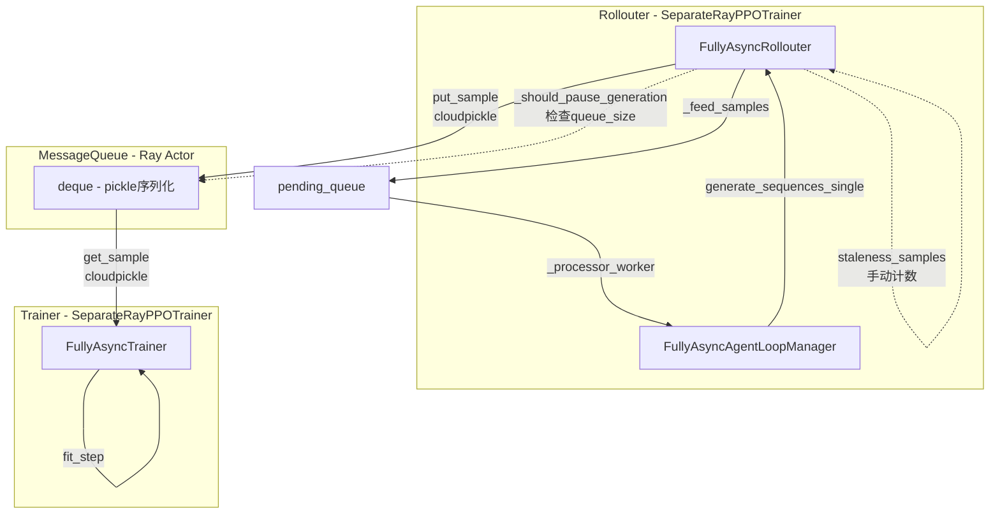
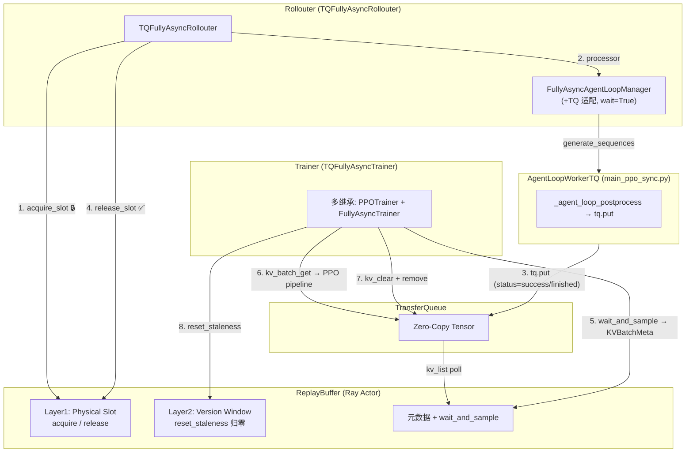
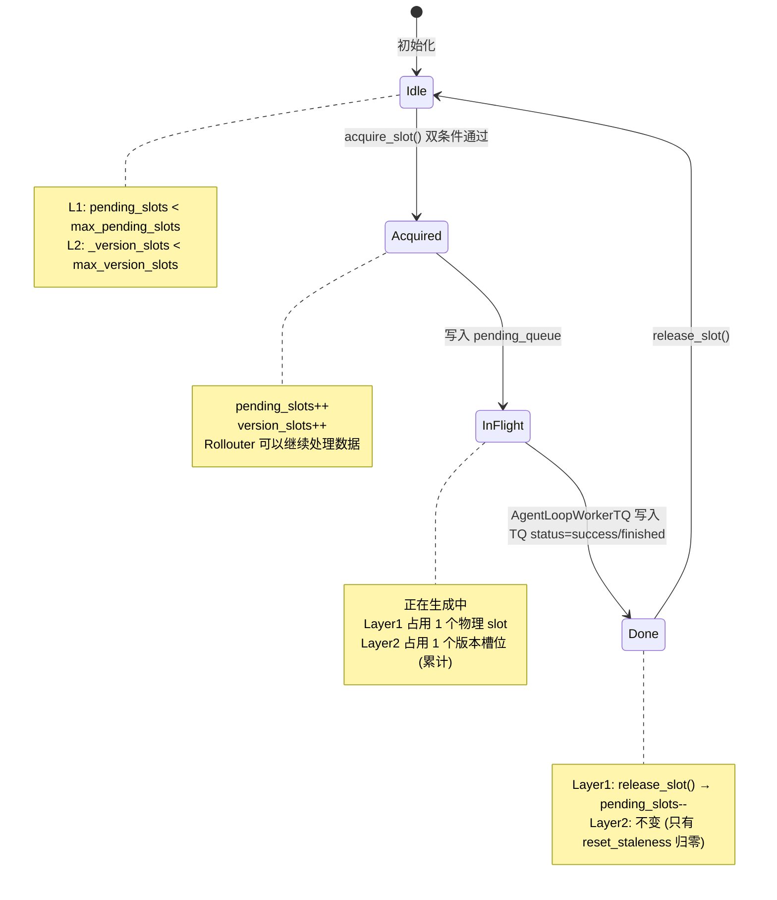
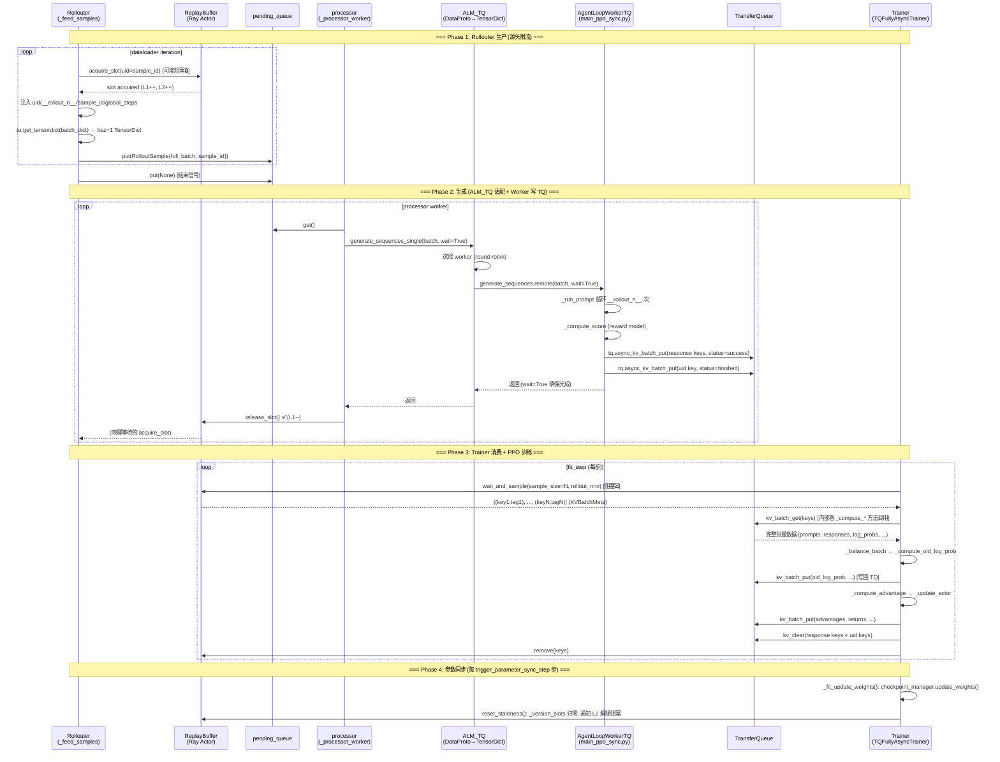

# Fully Async Policy with TransferQueue (TQ)

## 概述

本方案在 `fully_async_policy` 基础上，将数据传输通道从 Ray **MessageQueue** 迁移到 **TransferQueue (TQ)**，
同时训练侧通过**多继承**复用 `main_ppo_sync.py` 的 `PPOTrainer` 以直接使用 TQ 原生的 `KVBatchMeta` 训练流程。

### 核心设计原则

1. **最小改动**: `FullyAsyncAgentLoopManager` 整体不动，保持现有推理生成逻辑；仅通过 `FullyAsyncAgentLoopManagerTQ` 轻量适配
2. **ReplayBuffer 控制流速**: 用 ReplayBuffer (Ray Actor) 的 Dual-Layer Slot 机制替代原 `_should_pause_generation`
3. **TQ 替换 MessageQueue**: 数据走 TQ 零拷贝通道，元数据走 ReplayBuffer
4. **Trainer 多继承 PPOTrainer**: 通过 `class FullyAsyncTrainerTQ(PPOTrainer, FullyAsyncTrainer)` 复用 TQ 训练流程

### 核心目标

1. **零拷贝传输**: 使用 TQ 替代 MessageQueue，避免 `ray.cloudpickle` 序列化开销
2. **源头限流**: 在 dataloader 数据获取处 (`_feed_samples`) 通过 `acquire_slot()` 控制生产速度
3. **背压控制**: Dual-Layer Slot 机制限制 in-flight 请求数，无需额外的暂停/恢复逻辑
4. **复用成熟代码**: Trainer 侧多继承 PPOTrainer，直接使用 TQ 原生的 batch 训练流程（_compute_old_log_prob, _
   compute_advantage 等）

## 架构对比

### 现有架构 (MessageQueue + SeparateRayPPOTrainer)



**问题**:

- 数据完整 `ray.cloudpickle` 序列化/反序列化开销大
- Ray Actor 单点瓶颈 (MessageQueue)
- `_should_pause_generation` 暂停逻辑复杂 (drain → resume)
- Trainer (`SeparateRayPPOTrainer`) 与 colocate 训练流程差异大，维护两套代码

### 新架构 (TQ + ReplayBuffer + PPOTrainer 多继承)



**核心变化**:

| 维度                   | 现有架构                                           | 新架构                                         |
|----------------------|------------------------------------------------|---------------------------------------------|
| **数据通道**             | MessageQueue (pickle)                          | TransferQueue (zero-copy)                   |
| **元数据通道**            | 无 (混在数据里)                                      | ReplayBuffer (Ray Actor)                    |
| **流速控制**             | `_should_pause_generation` + staleness_samples | `acquire_slot()` 在 `_feed_samples` 源头控制     |
| **Trainer 基类**       | `SeparateRayPPOTrainer`                        | `PPOTrainer` × `FullyAsyncTrainer` 多继承      |
| **数据写入者**            | Rollouter._process_single_sample_streaming     | `AgentLoopWorkerTQ._agent_loop_postprocess` |
| **AgentLoopManager** | `FullyAsyncAgentLoopManager`                   | `FullyAsyncAgentLoopManagerTQ` (轻量子类)       |
| **暂停/恢复逻辑**          | paused + drain + resume                        | **不需要** (slot 阻塞即限流)                        |

## 核心组件

### 1. ReplayBuffer (Ray Actor) — 元数据通道 + Dual-Layer Slot 流控

文件: [`replay_buffer.py`](replay_buffer.py)

轻量级 Ray Actor，同时承担**元数据存储**和 **Dual-Layer Slot 流速控制**两大职责。

#### Dual-Layer Slot 控制机制

`acquire_slot()` 是 Rollouter 和 RB 之间的**唯一卡控接口**，同时承担两个职责：

```
┌──────────────────────────────────────────────────────────────────────┐
│                    acquire_slot() 双条件检查                          │
│                                                                      │
│  Layer 1: Physical (物理限流 / OOM 防护)                             │
│    条件: _pending_slots < max_pending_slots                           │
│    来源: max_concurrent_samples (如 TP×PP×16)                        │
│    作用: 防 OOM / GPU 过载                                           │
│    释放: release_slot() (Rollouter 写入 TQ 后调用)                    │
│                                                                      │
│  Layer 2: Version Window (陈旧度控制 / stale sample 防护)            │
│    条件: _version_slots < max_version_slots                           │
│    来源: required_samples × trigger_parameter_sync_step              │
│    作用: 防止样本参数版本过旧                                         │
│    释放: reset_staleness() 归零（Trainer 参数同步后调用）             │
│                                                                      │
│  ✅ 两个条件都满足 → 发放 slot (_pending_slots++, _version_slots++)  │
│  ❌ 任一不满足   → 阻塞等待                                           │
└──────────────────────────────────────────────────────────────────────┘
```

状态流转:



#### 核心接口

| 接口                                                      | 调用方                                        | 说明                            |
|---------------------------------------------------------|--------------------------------------------|-------------------------------|
| `acquire_slot(timeout, uid)`                            | Rollouter._feed_samples                    | 获取写入 slot（阻塞，双条件检查）           |
| `release_slot()`                                        | Rollouter._process_single_sample_streaming | 释放物理 slot                     |
| `wait_and_sample(partition_id, sample_size, rollout_n)` | Trainer._get_keys_from_rb                  | 阻塞等待足够数量的 finish 样本           |
| `remove(partition_id, keys)`                            | Trainer._cleanup_batch                     | 移除已消费样本的元数据                   |
| `reset_staleness()`                                     | Trainer._fit_reset_staleness               | 参数同步后重置版本窗口，归零 _version_slots |
| `signal_finish()`                                       | Rollouter._streaming_generation_main       | 通知生产结束                        |

#### 后台任务

- **`_poll_from_tq()`**: 定期轮询 `tq.kv_list()` 获取 TQ 全局快照，原子替换 `self.partitions`。包含 UID 完整性检查：检测孤儿
  key（meta.uid 与 key 前缀不匹配）并自动清理。
- **`_monitor_loop()`**: 每 60 秒打印 buffer 统计信息。

#### 调用方式

```python
# Rollouter 侧 (在 Ray Actor 内部，async)
acquired = await asyncio.wrap_future(self.replay_buffer.acquire_slot.remote(timeout=None, uid=sample_id).future())

# Trainer 侧 (在 Ray Actor 内部，async)
sampled_keys_meta = await self.replay_buffer.sample.remote(
    partition_id="train", sample_size=N, rollout_n=n
)
```

---

### 2. FullyAsyncAgentLoopManagerTQ — AgentLoop 轻量适配层

文件: [`fully_async_rollouter_tq.py`](fully_async_rollouter_tq.py)

**关键点**:

- Worker 类从默认改为 `AgentLoopWorkerTQ`（定义在 `main_ppo_sync.py` 中）
- `generate_sequences_single` 增加 `wait=True`：确保 Rollouter 知道生成何时完成，避免死锁
- `AgentLoopWorkerTQ._agent_loop_postprocess` 直接将结果写入 TQ（`tq.async_kv_batch_put`），不返回数据给 Rollouter

**数据写入 TQ 后的生命周期**:

1. `AgentLoopWorkerTQ` 写入 `{uid}_{session_id}_{index}` 个 response key (status=success)
2. `AgentLoopWorkerTQ` 写入 `{uid}` uid-level key (status=finished)
3. ReplayBuffer `_poll_from_tq` 通过 `tq.kv_list()` 发现新 key，更新 `self.partitions`
4. ReplayBuffer `wait_and_sample` 检测到足够多的 finished uid，返回给 Trainer
5. Trainer 通过 `tq.kv_batch_get` 读取完整数据，执行 PPO 训练
6. Trainer 训练完成后 `tq.kv_clear` + `rb.remove` 清理

---

### 3. TQFullyAsyncRollouter — Rollouter 适配层

文件: [`fully_async_rollouter_tq.py`](fully_async_rollouter_tq.py)

基于 `FullyAsyncRollouter` 的增量修改子类。核心变化集中在数据馈送、样本处理和验证三个环节。

#### 3.1 `_feed_samples` — 源头限流

**与基类的关键区别**:

- 不再调用 `prepare_single_generation_data()` (不做 repeat(n))，改为注入 `__rollout_n__` 字段让
  `AgentLoopWorkerTQ._run_prompt` 内部循环 n 次
- `batch_size=1` (bsz=1)，每个 prompt 单独处理
- `uid`/`__rollout_n__`/`sample_id`/`global_steps` 作为 `np.array` 注入到 plain dict 中，在 `tu.get_tensordict()` 后变为
  `NonTensorStack`

#### 3.2 `_process_single_sample_streaming` — 简化为 generate + release

**与基类的核心区别**: 基类需要手动将生成结果 put 到 MessageQueue；TQ 路径下数据写入由
`AgentLoopWorkerTQ._agent_loop_postprocess` 完成，Rollouter 只需调用 generate 然后 release_slot。

#### 3.3 删除/禁用的方法

| 方法                           | 处理方式       | 原因                                |
|------------------------------|------------|-----------------------------------|
| `_should_pause_generation()` | 返回 `False` | 由 `acquire_slot` 替代               |
| `_async_monitor_loop()`      | 空实现        | 监控由 ReplayBuffer._monitor_loop 承担 |

#### 3.4 验证流程 `_validate`

覆盖基类的验证方法，使用 TQ + ReplayBuffer 路径。

### 4. TQFullyAsyncTrainer — 多继承 Trainer

**最核心的设计决策**: 通过 Python 多继承 `class FullyAsyncTrainerTQ(PPOTrainer, FullyAsyncTrainer)` 同时获得两边能力：

```python
"""
MRO: TQFullyAsyncTrainer → PPOTrainer → FullyAsyncTrainer → SeparateRayPPOTrainer → ...

Data flow:
    TQFullyAsyncRollouter --(tq.kv_batch_put)--> TransferQueue (status=finish)
        |
    TQFullyAsyncTrainer <-(RB.wait_and_sample)--+--(KVBatchMeta)--> [PPOTrainer pipeline]
                                                    |
                                              update_actor(KVBatchMeta)
"""
```

## 数据流详解

### 完整生命周期时序图



### Dual-Layer Slot Control 详细语义

| 原概念 (MessageQueue 路径)         | 新实现 (TQ 路径)                         |
|-------------------------------|-------------------------------------|
| `MessageQueue.queue_size`     | `RB._pending_slots` (Layer 1: 物理限流) |
| `max_queue_size`              | `max_pending_slots` (Layer 1)       |
| `_should_pause_generation()`  | **删除** — `acquire_slot()` 双条件即限流    |
| `staleness_samples` (手动计数)    | `RB._version_slots` (Layer 2: 累计计数) |
| `max_required_samples`        | `max_version_slots` (Layer 2)       |
| `paused` + `drain` + `resume` | **保留但不再触发卡控** — 仅用于参数同步时的安全 drain   |

**改动前后的对比**:

```
改动前 (双重限流, 复杂状态机):
  1. _should_pause_generation(): queue_size >= max_queue_size → pause
  2. _should_pause_generation(): staleness_samples >= max_required_samples → pause
  → 需要 paused/drain/resume 状态机

改动后 (acquire_slot 单接口双条件):
  1. _feed_samples(): acquire_slot()
     → Layer 1 不满足? 阻塞 (物理满)
     → Layer 2 不满足? 阻塞 (版本窗口满, 等 reset_staleness)
     → 都满足? 放行
  → 简洁的令牌桶语义, 无需额外状态机
```

**参数同步流程**:

```
Trainer.fit_step:
  1. wait_and_sample(batch_size) → 从 RB 获取 finish 样本
  2. ... PPO 训练流程 (_compute_* / _update_*) ...
  3. update_weights() → NCCL 同步权重到 Rollouter GPUs
  4. reset_staleness():
       a. _version_slots = _pending_slots + train_finished_slots (重新计算)
       b. 重置计时器 (step_start_time, idle_start_time)
       c. 通知 _slot_available → 解除 acquire_slot 的 Layer 2 阻塞
```

## 使用方法

### 启动脚本示例

核心配置要点:

```bash
# ====== 必要的 fully_async 配置 ======
fully_async=(
  data.train_batch_size=0                 # TQ 模式下无效，默认 0
  data.gen_batch_size=1                   # streaming 逐条生成
  trainer.test_freq=-1                     # 由 rollouter 负责 validate
  actor_rollout_ref.hybrid_engine=False    # 分离式架构
  actor_rollout_ref.rollout.calculate_log_probs=True  # 使用 rollout log_prob
  rollout.total_rollout_steps=$(((512*100)))          # 总生成样本数
  trainer.nnodes=1                         # Trainer 节点数
  trainer.n_gpus_per_node=4                # Trainer 每 GPU 数
  rollout.nnodes=1                         # Rollouter 节点数
  rollout.n_gpus_per_node=4                # Rollouter 每 GPU 数
  async_training.staleness_threshold=0.5   # 陈旧度阈值
  async_training.trigger_parameter_sync_step=4  # 参数同步频率
  async_training.require_batches=1         # 每次 fetch 的 batch 数
  async_training.partial_rollout=True       # 支持 partial rollout
)

# ====== TQ 特有配置 ======
transfer_queue=(
  transfer_queue.enable=True               # ★ 启用 TQ 模式
)
```

### 依赖安装

```bash
pip install TransferQueue==0.1.8
```

所有 TQ 相关代码都有 fallback：当 `import transfer_queue` 失败时，自动使用 `verl.utils.transferqueue_utils` 中的 mock 实现。