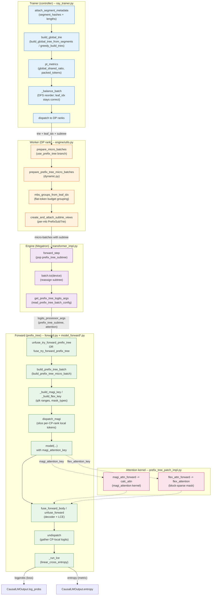

# Prefix-Tree (MAGI) Attention

The prefix-tree attention system (MAGI) enables prefix-deduplicated training for
LLMs. It packs multiple sequences with shared prefixes into a flat layout where
shared tokens are processed once. This README is the **implementation reference**
for the module; design and usage are covered in
[`docs/advance/prefix_tree.md`](../../../docs/advance/prefix_tree.md).

## Architecture

### Data flow



This graph traces the prefix-tree (MAGI) forward path from the trainer's trie
build through worker micro-batching, Megatron engine subtree handling, and the
prefix-tree forward path down to the attention kernel and the fused linear
cross-entropy loss. Solid edges show call/data flow between levels (trie,
leaf_idx, subtree, magi_key); dashed edges show the attention-key hand-off into
the patched TEDotProductAttention layer.

### Trie -> packed layout

```
Samples (shared prompt P, responses R0..R3):
  [P R0]  [P R1]  [P R2]  [P R3]

Compressed trie:
  root
   └─ P (shared prefix, 1 node)
       ├─ leaf: R0
       ├─ leaf: R1
       ├─ leaf: R2
       └─ leaf: R3

Flat packed layout (tokens processed once):
  ┌─────┬─────┬─────┬─────┬─────┐
  │  P  │ R0  │ R1  │ R2  │ R3  │
  └─────┴─────┴─────┴─────┴─────┘
   shared   each response attends to P + itself
   (1x)     via block-sparse mask from trie structure

  Without prefix-tree: P processed 4x (once per rollout)
  With prefix-tree:    P processed 1x (shared node)
```

### Key components

**Data structures** (`tree.py`):
- `TrieNode`: compressed trie node with `flat_idx`, `input_ids`, `ancestor`, `children`.
- `PrefixTrie`: full batch view with flat `nodes` list indexed by `flat_idx`.
- `PrefixSubTrie`: per-micro-batch serializable view (`__getstate__`/`__setstate__` for pickle across PP ranks).

**Layout building** (`utils.py`):
- `build_layout_from_tree_node()`: walks the trie, assigns flat offsets, emits attention ranges (`q_ranges`, `k_ranges`, `mask_types`).
- `PrefixTreeParams`: holds the packed layout — flat tokens, attention spec rectangles, leaf-to-sample mapping.
- Pre-packed labels avoid `torch.roll` cross-boundary bugs at group edges.

**MAGI integration** (`magi.py`):
- Dispatch happens **once per forward** (not per-layer) via `dispatch_magi`.
- `get_position_ids(magi_key)` returns local token indices for the CP rank.
- The model receives pre-dispatched `local_input_ids` / `local_position_ids`.
- `undispatch()` gathers local logits back to the full layout for loss computation.

**Attention patch** (`prefix_tree_patch_impl.py`):
- Patches `TEDotProductAttention.forward` to add MAGI/flex branches.
- `magi_attn_forward()` calls `calc_attn()` from the `magi_attention` package.
- Falls back to FA3 if neither MAGI nor flex key is provided.

**Forward drivers** (`forward.py`):
- `unfuse_try_forward_prefix_tree` / `fuse_try_forward_prefix_tree`: entry points for unfused and fused forward paths.
- `_build_magi_key` / `_build_flex_key`: build the attention key from model config and the trie.
- `fuse_forward_body`: the fused-path body that wires RoPE + decoder-key contexts + the model call.

**Micro-batch grouping** (`dynamic.py`):
- `mbs_groups_from_leaf_idx`: groups samples into prefix-aware micro-batches using the reorder-safe `leaf_idx` (not the stale `sequence_ids`).
- `prepare_prefix_tree_micro_batches`: splits the batch into micro-batches and attaches subtrie views.

**Trainer helpers** (`trainer.py`):
- `attach_segment_metadata` + `build_global_trie`: build the global trie at the trainer level (before DP dispatch).
- `pt_metrics`: compute prefix-sharing metrics (`global_shared_ratio`, `micro_batch_shared_ratio`, `packed_tokens`, `raw_tokens`, `avg_mbs`, `timing_s`).

**Segment grouper** (`segment_grouper.py`):
- `create_grpo_segment_metadata()`: fast hash-based segment metadata for GRPO.
- `group_by_segment_hash()`: groups samples by shared prefix segment.

## Parallelism Support

The prefix-tree (MAGI) path coexists with Megatron's TP, CP, SP, PP, and the
fused-kernel switch.

### Tensor parallelism (TP)

Supported. `ColumnParallelLinear` on `linear_qkv` shards heads across TP ranks,
so each rank's local Q/K/V hold `num_heads / tp_size` heads. The MAGI key encodes
per-rank head counts in `_build_magi_key` (`forward.py`):
`num_heads_q = cfg.num_attention_heads // tp_size`, KV falls back to
`num_attention_heads` when `num_query_groups` is unset. The kernel reads head
counts from `q.size(1)/k.size(1)`; the key's `num_heads_q` must match for the
`flatten_head_groups` path. Padding to TP/CP divisibility is handled in
`_finalize_prefix_tree_batch` (`forward.py`): pads `tree_packed_tokens` to
`tp_size` (CP=1) or `tp_size * cp_size * 2` (CP>1). Padding tokens are not in
attention rectangles and are stripped before loss.

### Context parallelism (CP)

Supported, magi backend only. CP dispatch is **non-contiguous**: each CP rank
holds a topology-driven slice of the flat layout, not a sequential block.
Megatron's rank-sliced RoPE is therefore wrong; the RoPE patch
(`_rope_fwd_with_pids` in `prefix_tree_patch_impl.py`) builds the full RoPE table
and indexes by actual local `position_ids`.

- `dispatch_magi(pb)` (`forward.py`) calls `get_position_ids(magi_key)` to slice
  `tree_packed_input_ids`/`position_ids` to `(1, local_tokens)`; CP=1 covers all
  tokens.
- `undispatch(...)` gathers local logits/entropy back to full flat before loss.
  Unfused: `forward.py` `unfuse_try_forward_prefix_tree`; fused: `_run_lce`.
- The magi key carries `cp_group_or_mesh` and
  `DistAttnConfig(dispatch_config=DispatchConfig(uneven_shard=True))` so the kernel
  knows attention spans CP ranks.

`flex` does **not** support CP: `_build_flex_key` builds a single full-layout
`block_mask` with no CP slicing.

### Sequence parallelism (SP)

Supported automatically. The model uses `ColumnParallelLinear` for QKV plus
`RowParallelLinear` + `gather_from_sequence_parallel_region` for the output
projection; the prefix-tree path does not touch this. In the fused LCE path,
`_run_lce` explicitly gathers hidden states out of the SP region before
`linear_cross_entropy`. The unfused path runs `logits_processor` on already-
gathered logits.

### Pipeline parallelism (PP)

Supported. All PP stages receive the same MAGI-dispatched local tokens. Stage 0
embeds `local_input_ids` and emits `(seq, 1, hidden)` seq-first. Intermediate
stages keep seq-first. Last stage runs LCE on local hidden, undispatches to full
flat, expands per-sample. Unfused returns `output_orig.permute(1, 0, 2)` for
non-last stages; fused returns raw hidden (`fuse_forward_body`).

### Fused vs unfused path

Two forward drivers, selected by `use_fused_kernels` (`transformer_impl.py`):

| Path | Entry | Vocab projection | When used |
|------|-------|------------------|-----------|
| Fused | `fuse_try_forward_prefix_tree` (`forward.py`) | `linear_cross_entropy` (no logits tensor) | `use_fused_kernels=True` + `use_remove_padding=True` + scalar temperature |
| Unfused | `unfuse_try_forward_prefix_tree` (`forward.py`) | materialises `(flat_tokens, vocab)` logits, runs `logits_processor` | per-sample temperature, or fused kernels off |

Both share `build_prefix_tree_batch`, `_prepare_attn_inputs`, and `dispatch_magi`.
The fused path calls `fuse_forward_body` via the patched `_fused_GPTModel_forward`
(`model_forward_fused.py`), which installs `prefix_tree_rope_context` +
`prefix_tree_decoder_key_context` and delegates to `fuse_forward_body` for
preprocess → decoder → LCE. The unfused path calls `model(...)` directly with
`magi_attention_key` in `attn_kwargs`, then runs `logits_processor` outside the
model. Fused-path limitation: scalar temperature only (`linear_cross_entropy`
asserts `isinstance(temperature, float)`); per-sample temperature must use the
unfused path.

### VLM asymmetry

VLM-config models (e.g. Qwen3.5) have `vision_model = hasattr(hf_config,
"vision_config")` at both call sites in `transformer_impl.py`.

- **Unfused** blocks VLM unconditionally (`forward.py`): 3D M-RoPE is not wired,
  so any VLM batch falls back to standard THD.
- **Fused** blocks only VLM-with-images (`forward.py`):
  `if vision_model and has_vision_data:` falls back; text-only on VLM-config
  models proceeds through the prefix-tree path. The `has_vision_data` check lives
  only at this guard, so `vision_model=True` still triggers M-RoPE handling in
  the standard (non-prefix-tree) path.

## Data Reorder and Dynamic Micro-Batching

The prefix-tree path reorders the global batch for DP balance + prefix locality,
then splits into prefix-aware micro-batches.

### Why reorder

`_balance_batch` (`ray_trainer.py`) reorders so each DP rank receives similar
total tokens. For prefix-tree, the reorder has a second goal: **prefix locality**
— samples sharing a long prefix should land on the same DP rank and adjacent
micro-batch slots so the trie can dedup them. The prefix-tree reorder achieves
both by reordering in DFS trie order first, then partitioning contiguously.

### DFS reorder + contiguous partition

`reorder_and_balance_for_prefix_tree` (`dynamic.py`) calls
`get_dfs_balanced_partitions` with `contiguous_partitions=True`:

1. `dfs_leaf_order(seqs, trie=attached_trie)` walks the trie in DFS pre-order,
   emitting sample indices so same-prefix samples are contiguous.
2. `data.reorder(torch.tensor(dfs_order))` permutes the batch.
3. `contiguous_partitions=True` slices into `dp_size` equal contiguous chunks:
   rank `r` gets `[r*per_rank, (r+1)*per_rank)`. Each rank's samples stay
   trie-adjacent.

After dispatch, `reorder_and_balance_for_prefix_tree` calls `data.reorder(arange)`
to undo the controller-side permutation so each rank sees its slice in natural
order.

### Reorder-safety: `leaf_idx` is the source of truth

The trie's `sequence_ids` and `leaves[]` are indexed by **original** sample
position and go stale after `DataProto.reorder` (inside `_balance_batch`).
`leaf_idx` (numpy array in `non_tensor_batch`) is fancy-indexed by reorder
automatically and stays correct: `leaf_idx[new_pos]` always holds the leaf
`flat_idx` for the sample now at `new_pos`. `build_global_trie` (`trainer.py`)
attaches both `meta_info["prefix_tree"]` (the `TrieNode` root) and
`non_tensor_batch["leaf_idx"]` (np.int64, sample → leaf `flat_idx`). The trie is
**not** reordered (its `flat_idx` space is immutable); only the per-sample
mapping moves with the batch.

The sort order is **tree-then-sort**: build the trie, then `_balance_batch`
reorders for DP balance. The `leaf_idx`-driven grouping makes this safe.

### Dynamic micro-batching (`use_dynamic_bsz=True`)

`prepare_prefix_tree_micro_batches` (`dynamic.py`) reads `max_token_len_per_gpu`
and interprets it as a **flat (deduplicated) token budget** (not raw sequence
length): `max_token_len = data["max_token_len_per_gpu"] * sp_size`, then
`mbs_groups_from_leaf_idx(leaf_idx, trie, max_token_len)`.

`mbs_groups_from_leaf_idx` builds `leaf_to_positions` from `leaf_idx`
(reorder-safe), then walks the trie in DFS leaf order via `_mbs_groups_dfs`.
Budget is flat tokens: prefix counted once + unique branch tokens. When adding
the next leaf's path would exceed the budget, the current group is closed.
Duplicates (identical sequences sharing a leaf) stay in the same group to avoid
a singleton group that would force `same_micro_num_in_dp` to pad the other DP
rank. After grouping, micro-batches are sorted into inc-then-dec flat-token order
to reduce PP bubbles, preserving prefix locality within each group.

### Fixed micro-batching (`use_dynamic_bsz=False`)

When `max_token_len_per_gpu` is absent, `prepare_prefix_tree_micro_batches` reads
`micro_batch_size_per_gpu` and chunks in DFS trie order:
`dfs_order = trie_dfs_leaf_order_from_leaf_idx(leaf_idx, trie)` then slices
`[dfs_order[i:i+mbs] for i in range(0, n, mbs)]`. Same-prefix samples still land
together because `dfs_order` is trie-ordered, but the budget is sequence count,
not flat tokens.

### Subtrie views per micro-batch

`create_and_attach_subtrie_views` (`dynamic.py`) reads `leaf_idx` from each
microbatch's `non_tensor_batch` and builds a `PrefixSubTrie` (`tree.py`) pruned
to that microbatch's leaves, iterating `mb_leaf_idx.tolist()` and raising on any
`-1`. The subtrie is attached as `prefix_tree_subtree` and later read by
`build_prefix_tree_batch` (`forward.py`). `PrefixSubTrie` is serialisable via
`__getstate__`/`__setstate__` (`tree.py`), storing compact per-node data so it
survives pickle across PP ranks without dragging the full trie.

### The `leaf_idx` contract

1. `build_global_trie` attaches `non_tensor_batch["leaf_idx"]` (np.int64, sample →
   leaf `flat_idx`; `-1` if no leaf).
2. `_balance_batch` reorders; `leaf_idx` follows via numpy fancy-indexing.
3. `prepare_prefix_tree_micro_batches` calls `mbs_groups_from_leaf_idx` (dynbsz)
   or `trie_dfs_leaf_order_from_leaf_idx` (fixed mbs).
4. `create_and_attach_subtrie_views` reads `leaf_idx` per microbatch to build the
   subtrie view.

All `leaf_idx`-based paths raise `ValueError` on `-1` entries: a sample without a
leaf is a bug in `build_global_trie`, not a silent skip.
`prepare_prefix_tree_micro_batches` also raises if a trie is attached but
`leaf_idx` is missing.

## Metric aggregation: wrap floats in `Metric`

`engine_workers._postprocess_output` aggregates metrics via
`allgather_dict_into_dict` (wraps each value as `[val]` per DP rank) +
`chain.from_iterable` (flattens lists-of-lists). Raw floats wrapped as
`[float]` crash `chain.from_iterable` because floats aren't iterable.

- Metrics added **before** allgather must be wrapped in
  `Metric(value, aggregation=...)` so `Metric.aggregate_dp` handles them.
- Metrics added **after** allgather (`loss`, `grad_norm`, `lr`, `mfu`, `perf/*`)
  stay scalar and bypass the list branch.
- `prefix_tree/attn_fa3_fallback_ratio` uses `Metric(MEAN)`. The counter tracks
  only `fa3` and `total` (the magi/flex distinction is dropped; only the FA3
  fallback ratio matters).

## VLM-config models (Qwen3.5): `vision_model` gating

For text-only prefix-tree on VLM-config models (e.g. Qwen3.5),
`vision_model = hasattr(hf_config, "vision_config")` at both call sites in
`transformer_impl.py`. Do **not** add `and "pixel_values" in multi_modal_inputs`;
that breaks the standard (non-prefix-tree) path for Qwen3.5 because
`vision_model=True` is needed to trigger the VLM code path that handles M-RoPE's
3D `position_ids` internally.

The `has_vision_data` check lives only at the fused path's prefix-tree guard:
`if use_prefix_tree and not (vision_model and has_vision_data):` (in
`model_forward_fused.py`).

## Tree-builder diagnostics

When `PrefixTreeParams.__post_init__` raises `last leaf range must end at total
sequence length`, the cause is `_assign_offsets` (uses `len(node.input_ids)`)
disagreeing with `_emit` (slices actual samples). The per-node trace log (emitted
in `build_layout_from_tree_node` when `last_leaf_end != total_tokens`) prints each
node's `flat_idx`, `iid_len`, `start`, `end`, `donated_in`, `donated_out`,
`n_children`.

Invariant per node: `end - start == (1 if donated_in else 0) + iid_len - (1 if donated_out else 0)`.
Any node violating this is the bug.

The OLP crash `no_padding_2_padding: token count mismatch` is a separate symptom:
`sum(prompt_len + response_len) != actual_tokens_in_output`. The diagnostic log
prints `prompt_lens`, `response_lens`, `sequence_lens` lists to identify which
sample is short.

## Configuration

```bash
# Enable prefix-tree with MAGI attention
actor_rollout_ref.model.use_prefix_tree=True
actor_rollout_ref.model.prefix_tree_attention=magi  # or "flex"
```

## Key Files

- `verl/utils/prefix_tree/magi.py`: main forward path
- `verl/utils/prefix_tree/tree.py`: data structures
- `verl/utils/prefix_tree/utils.py`: layout builder
- `verl/utils/prefix_tree/forward.py`: unfused/fused forward drivers
- `verl/utils/prefix_tree/dynamic.py`: trie build + micro-batch grouping
- `verl/utils/prefix_tree/segment_grouper.py`: fast segment metadata
- `verl/utils/prefix_tree/trainer.py`: trainer-facing helpers
- `verl/utils/prefix_tree/prefix_tree_patch_impl.py`: Megatron patches
