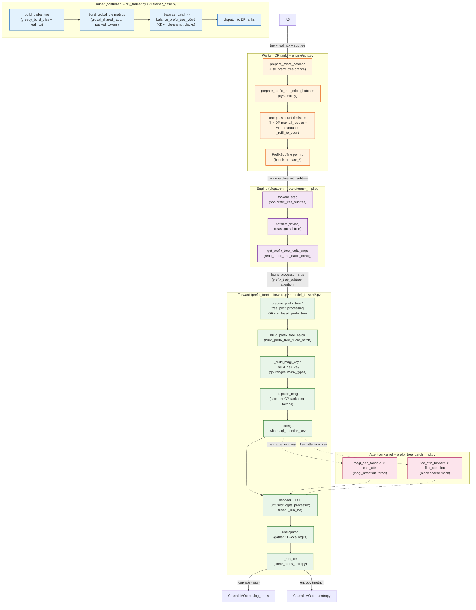

# Prefix-Tree (MAGI) Attention

The prefix-tree attention system (MAGI) enables prefix-deduplicated training for
LLMs. It packs multiple sequences with shared prefixes into a flat layout where
shared tokens are processed once. This README is the **implementation reference**
for the module; design and usage are covered in
[`docs/advance/prefix_tree.md`](../../../docs/advance/prefix_tree.md).

## Architecture

### Data flow


```mermaid
graph TD
    subgraph Trainer["Trainer (controller) -- ray_trainer.py / v1 trainer_base.py"]
        A1["build_global_trie<br/>(greedy_build_tries + leaf_idx)"]
        A2["build_global_trie metrics<br/>(global_shared_ratio, packed_tokens)"]
        A3["_balance_batch -><br/>balance_prefix_tree_v0/v1<br/>(KK whole-prompt blocks)"]
        A4["dispatch to DP ranks"]
        A1 --> A2 --> A3 --> A4
    end

    subgraph Worker["Worker (DP rank) -- engine/utils.py"]
        B1["prepare_micro_batches<br/>(use_prefix_tree branch)"]
        B2["prepare_prefix_tree_micro_batches<br/>(dynamic.py)"]
        B3["one-pass count decision:<br/>fill + DP-max all_reduce +<br/>VPP roundup + _refill_to_count"]
        B4["PrefixSubTrie per mb<br/>(built in prepare_*)"]
        B1 --> B2 --> B3 --> B4
    end

    subgraph Engine["Engine (Megatron) -- transformer_impl.py"]
        C1["forward_step<br/>(pop prefix_tree_subtree)"]
        C2["batch.to(device)<br/>(reassign subtree)"]
        C3["get_prefix_tree_logits_args<br/>(read_prefix_tree_batch_config)"]
        C1 --> C2 --> C3
    end

    subgraph Forward["Forward (prefix_tree) -- forward.py + model_forward*.py"]
        D1["prepare_prefix_tree / tree_post_processing<br/>OR run_fused_prefix_tree"]
        D2["build_prefix_tree_batch<br/>(build_prefix_tree_micro_batch)"]
        D3["_build_magi_key / _build_flex_key<br/>(q/k ranges, mask_types)"]
        D4["dispatch_magi<br/>(slice per-CP-rank local tokens)"]
        D5["model(...)<br/>with magi_attention_key"]
        D6["decoder + LCE<br/>(unfused: logits_processor; fused: _run_lce)"]
        D7["undispatch<br/>(gather CP-local logits)"]
        D8["_run_lce<br/>(linear_cross_entropy)"]
        D1 --> D2 --> D3 --> D4 --> D5 --> D6 --> D7 --> D8
    end

    subgraph Attn["Attention kernel -- prefix_tree_patch_impl.py"]
        E1["magi_attn_forward -> calc_attn<br/>(magi_attention kernel)"]
        E2["flex_attn_forward -> flex_attention<br/>(block-sparse mask)"]
    end

    A5 -->|"trie + leaf_idx + subtree"| B1
    B4 -->|"micro-batches with subtree"| C1
    C3 -->|"logits_processor_args<br/>(prefix_tree_subtree, attention)"| D1
    D5 -.->|"magi_attention_key"| E1
    D5 -.->|"flex_attention_key"| E2
    E1 -.-> D6
    E2 -.-> D6
    D8 -->|"logprobs (loss)"| F1["CausalLMOutput.log_probs"]
    D8 -->|"entropy (metric)"| F2["CausalLMOutput.entropy"]

    classDef trainer fill:#e3f2fd,stroke:#1565c0;
    classDef worker fill:#fff3e0,stroke:#e65100;
    classDef engine fill:#f3e5f5,stroke:#6a1b9a;
    classDef forward fill:#e8f5e9,stroke:#2e7d32;
    classDef attn fill:#fce4ec,stroke:#ad1457;
    class A1,A2,A3,A4 trainer;
    class B1,B2,B3,B4 worker;
    class C1,C2,C3 engine;
    class D1,D2,D3,D4,D5,D6,D7,D8 forward;
    class E1,E2 attn;
```

This graph traces the prefix-tree (MAGI) forward path from the trainer's trie
build through worker micro-batching, Megatron engine subtree handling, and the
prefix-tree forward path down to the attention kernel and the fused linear
cross-entropy loss. Solid edges show call/data flow between levels (trie,
leaf_idx, subtree, magi_key); dashed edges show the attention-key hand-off into
the patched TEDotProductAttention layer.

### Trie -> packed layout

```
Samples (shared prompt P, responses R0..R3):
  [P R0]  [P R1]  [P R2]  [P R3]

Compressed trie:
  root
   └─ P (shared prefix, 1 node)
       ├─ leaf: R0
       ├─ leaf: R1
       ├─ leaf: R2
       └─ leaf: R3

Flat packed layout (tokens processed once):
  ┌─────┬─────┬─────┬─────┬─────┐
  │  P  │ R0  │ R1  │ R2  │ R3  │
  └─────┴─────┴─────┴─────┴─────┘
   shared   each response attends to P + itself
   (1x)     via block-sparse mask from trie structure

  Without prefix-tree: P processed 4x (once per rollout)
  With prefix-tree:    P processed 1x (shared node)
```

### Key components

**Data structures** (`tree.py`):
- `TrieNode`: compressed trie node with `node_idx`, `input_ids`, `ancestor`, `children`.
- `PrefixTrie`: full batch view with flat `nodes` list indexed by `node_idx`.
- `PrefixSubTrie`: per-micro-batch serializable view (`__getstate__`/`__setstate__` for pickle across PP ranks).

**Layout building** (`utils.py`):
- `build_layout_from_tree_node()`: walks the trie, assigns flat offsets, emits attention ranges (`q_ranges`, `k_ranges`, `mask_types`).
- `PrefixTreeParams`: holds the packed layout — flat tokens, attention spec rectangles, leaf-to-sample mapping.
- Pre-packed labels avoid `torch.roll` cross-boundary bugs at group edges.

**MAGI integration** (`magi.py`):
- Dispatch happens **once per forward** (not per-layer) via `dispatch_magi`.
- `get_position_ids(magi_key)` returns local token indices for the CP rank.
- The model receives pre-dispatched `local_input_ids` / `local_position_ids`.
- `undispatch()` gathers local logits back to the full layout for loss computation.

**Attention patch** (`prefix_tree_patch_impl.py`):
- Patches `TEDotProductAttention.forward` to add MAGI/flex branches.
- `magi_attn_forward()` calls `calc_attn()` from the `magi_attention` package.
- Falls back to FA3 if neither MAGI nor flex key is provided.

**Forward drivers** (`forward.py`):
- `prepare_prefix_tree` / `tree_post_processing`: unfused entry points (called from `model_forward.py`).
- `run_fused_prefix_tree`: fused entry point (called from `model_forward_fused.py`).
- `_build_magi_key` / `_build_flex_key`: build the attention key from model config and the trie.

**Micro-batch grouping** (`dynamic.py`):
- `mbs_groups_from_leaf_idx`: groups samples into prefix-aware micro-batches using the reorder-safe `leaf_idx` (not the stale `sequence_ids`).
- `prepare_prefix_tree_micro_batches`: splits the batch into micro-batches (one-pass DP-count equalization + VPP-divisible refill on the dynbsz path, peel-one padding on the fixed path) and attaches subtrie views.
- `balance_prefix_tree_v0/v1` → `balance_prefix_tree_blocks`: KK whole-prompt DP balancing on the driver.

**Trainer helpers** (`trainer.py`):
- `build_global_trie`: greedy token-by-token build of the global trie at the trainer level (before DP dispatch); emits `global_shared_ratio` / `packed_tokens` / `raw_tokens` / `tree_build_time_s` into the metrics dict.
- `micro_batch_shared_ratio` and `num_micro_batches` are collected engine-side in `dynamic.py` (`_push_mbs_shared_ratio` / `_push_n_micro_batches`) and surfaced by `maybe_collect_prefix_tree_metrics` (engine).

## Parallelism Support

The prefix-tree (MAGI) path coexists with Megatron's TP, CP, PP, and the
fused-kernel switch.

### Tensor parallelism (TP)

Supported. `ColumnParallelLinear` on `linear_qkv` shards heads across TP ranks,
so each rank's local Q/K/V hold `num_heads / tp_size` heads. The MAGI key encodes
per-rank head counts in `_build_magi_key` (`forward.py`):
`num_heads_q = cfg.num_attention_heads // tp_size`, KV falls back to
`num_attention_heads` when `num_query_groups` is unset. The kernel reads head
counts from `q.size(1)/k.size(1)`; the key's `num_heads_q` must match for the
`flatten_head_groups` path. Padding to TP/CP divisibility is handled in
`_finalize_prefix_tree_batch` (`forward.py`): pads `tree_packed_tokens` to
`tp_size` (CP=1) or `tp_size * cp_size * 2` (CP>1). Padding tokens are not in
attention rectangles and are stripped before loss.

### Context parallelism (CP)

Supported, magi backend only. CP dispatch is **non-contiguous**: each CP rank
holds a topology-driven slice of the flat layout, not a sequential block.
Megatron's rank-sliced RoPE is therefore wrong; the RoPE patch
(`_rope_forward` in `prefix_tree_patch_impl.py`) builds the full RoPE table
and indexes by actual local `position_ids`.

- `dispatch_magi(pb)` (`forward.py`) calls `get_position_ids(magi_key)` to slice
  `tree_packed_input_ids`/`position_ids` to `(1, local_tokens)`; CP=1 covers all
  tokens.
- `undispatch(...)` gathers local logits/entropy back to full flat before loss.
  Unfused: `tree_post_processing`; fused: `_run_lce`.
- The magi key carries `cp_group_or_mesh` and
  `DistAttnConfig(dispatch_config=DispatchConfig(uneven_shard=True))` so the kernel
  knows attention spans CP ranks.

`flex` does **not** support CP: `_build_flex_key` builds a single full-layout
`block_mask` with no CP slicing.

### Pipeline parallelism (PP)

Supported. All PP stages receive the same MAGI-dispatched local tokens. Stage 0
embeds `local_input_ids` and emits `(seq, 1, hidden)` seq-first. Intermediate
stages keep seq-first. Last stage runs LCE on local hidden, undispatches to full
flat, expands per-sample. Unfused returns `output_orig.permute(1, 0, 2)` for
non-last stages; fused returns raw hidden.

### Fused vs unfused path

Two forward drivers, selected by `use_fused_kernels` (`transformer_impl.py`):

| Path | Entry | Vocab projection | When used |
|------|-------|------------------|-----------|
| Fused | `run_fused_prefix_tree` (`forward.py`) | `linear_cross_entropy` (no logits tensor) | `use_fused_kernels=True` + `use_remove_padding=True` + scalar temperature |
| Unfused | `prepare_prefix_tree` + `tree_post_processing` (`forward.py`) | materialises `(flat_tokens, vocab)` logits, runs `logits_processor` | per-sample temperature, or fused kernels off |

Both share `build_prefix_tree_batch`, `_prepare_attn_inputs`, and `dispatch_magi`.
The fused path routes through the patched `_fused_GPTModel_forward`
(`model_forward_fused.py`) with `prefix_tree_decoder_key_context`
(`forward.py`) injecting the magi/flex key, then `_run_lce` for the fused LCE.
The unfused path calls `model(...)` directly with
`magi_attention_key` in `attn_kwargs`, then runs `logits_processor` outside the
model. Fused-path limitation: scalar temperature only (`linear_cross_entropy`
asserts `isinstance(temperature, float)`); per-sample temperature must use the
unfused path.

### VLM asymmetry

VLM-config models (e.g. Qwen3.5) have `vision_model = hasattr(hf_config,
"vision_config")` at both call sites in `transformer_impl.py`.

- **Unfused** blocks VLM unconditionally (`forward.py`): 3D M-RoPE is not wired,
  so any VLM batch falls back to standard THD.
- **Fused** blocks only VLM-with-images (`forward.py`):
  `if vision_model and has_vision_data:` falls back; text-only on VLM-config
  models proceeds through the prefix-tree path. The `has_vision_data` check lives
  only at this guard, so `vision_model=True` still triggers M-RoPE handling in
  the standard (non-prefix-tree) path.

## Data Reorder and Dynamic Micro-Batching

The prefix-tree path reorders the global batch for DP balance + prefix locality,
then splits into prefix-aware micro-batches.

### Why reorder

`_balance_batch` (v0: `ray_trainer.py`; v1: `trainer_base.py`) reorders so each
DP rank receives similar total tokens. For prefix-tree, the reorder has a second
goal: **prefix locality** — a prompt's rollouts must land on the same DP rank so
the trie can dedup their shared prefix (uid atomicity: GRPO advantage grouping
also requires it).

### Whole-prompt block balance (KK)

`balance_prefix_tree_v0/v1` (`dynamic.py`) call `balance_prefix_tree_blocks`:

1. Samples are grouped into blocks by prompt identity (`uid`); a block's
   rollouts are never split across ranks.
2. Each block's weight = `calculate_workload(flat_tokens)` (`24576*n + n^2`).
3. `get_seqlen_balanced_partitions` (Karmarkar-Karp) assigns blocks to
   `dp_size` ranks for balanced workload.
4. A rank-major permutation (`permutation[new_pos] = original sample index`) is
   applied via `data.reorder`, then slices are dispatched. Each rank also
   receives the shared global trie and its `leaf_idx` slice.

After dispatch, ranks see their slice in natural order; the trie itself is never
reordered (its `node_idx` space is immutable).

### Reorder-safety: `leaf_idx` is the source of truth

The trie's `sequence_ids` and `leaves[]` are indexed by **original** sample
position and go stale after `DataProto.reorder` (inside `_balance_batch`).
`leaf_idx` (numpy array in `non_tensor_batch`) is fancy-indexed by reorder
automatically and stays correct: `leaf_idx[new_pos]` always holds the leaf
`node_idx` for the sample now at `new_pos`. `build_global_trie` (`trainer.py`)
attaches both `meta_info["prefix_tree"]` (the `TrieNode` root) and
`non_tensor_batch["leaf_idx"]` (np.int64, sample → leaf `node_idx`). The trie is
**not** reordered (its `node_idx` space is immutable); only the per-sample
mapping moves with the batch.

The sort order is **tree-then-sort**: build the trie, then `_balance_batch`
reorders for DP balance. The `leaf_idx`-driven grouping makes this safe.

### Dynamic micro-batching (`use_dynamic_bsz=True`)

`prepare_prefix_tree_micro_batches` (`dynamic.py`) reads `max_token_len_per_gpu`
and interprets it as a **flat (deduplicated) token budget** (not raw sequence
length): `max_token_len = data["max_token_len_per_gpu"] * sp_size`.

Grouping is a leaf-greedy DFS walk (`_mbs_groups_dfs`) over `leaf_entries`
(built reorder-safely from `leaf_idx` by `_leaf_entries_from_leaf_idx`): leaves
are taken in DFS order; each leaf's cost is the trie nodes on its path not
already covered in the current group (prefix counted once). When adding the
next leaf's path would exceed the budget, the group is closed and the prefix is
re-materialized in the next one. Duplicates (identical sequences sharing a
leaf) stay in the same group.

Each DP rank's natural bucket count is whatever its fill produced — counts can
differ across ranks. They are equalized in a **single comm pass**:

1. `all_reduce(MAX)` over the DP group agrees on the target count;
2. `roundup_divisible(target, num_batches_divided_by)` bakes in VPP/PP
   divisibility (before any adjustment — same order as the non-tree path);
3. a rank below target **refills** (`_refill_to_count`): binary-search the
   smallest budget whose fill count <= target (count is non-increasing in
   budget, and the natural fill already satisfies count <= target, so an exact
   landing exists whenever one does), with a peel-one fallback (last sample of
   the largest bucket becomes an mbs=1 bucket) for plateau gaps;
4. if the count still falls short (a rank has fewer samples than the target),
   warn and continue with unequal counts.

The dynbsz/fixed branch choice must be identical on every rank of the DP group —
each branch performs its own `all_reduce`, so a per-rank disagreement would
desync the collective. Safe because `use_dynamic_bsz` and `max_token_len_per_gpu`
are driver-attached before DP dispatch.

After grouping, micro-batches are sorted into inc-then-dec flat-token order
to reduce PP bubbles, preserving prefix locality within each group.

### Fixed micro-batching (`use_dynamic_bsz=False`)

When `max_token_len_per_gpu` is absent, `prepare_prefix_tree_micro_batches`
reads `micro_batch_size_per_gpu` and chunks **contiguously in batch order**
(`[i:i+mbs]` slices). Fixed-size chunks cannot budget-adjust, so DP-count
equalization and VPP divisibility both pad by peeling the last sample of the
largest bucket into an mbs=1 bucket (warn-and-continue when every bucket is
already a singleton).

### Subtrie views per micro-batch

`prepare_prefix_tree_micro_batches` builds a `PrefixSubTrie` (`tree.py`) per
micro-batch, pruned to that micro-batch's leaves, and attaches it as
`prefix_tree_subtree` (read later by `build_prefix_tree_batch` in `forward.py`).
`PrefixSubTrie` is serialisable via `__getstate__`/`__setstate__` (`tree.py`),
storing compact per-node data so it survives pickle across PP ranks without
dragging the full trie.

### The `leaf_idx` contract

1. `build_global_trie` attaches `non_tensor_batch["leaf_idx"]` (np.int64, sample →
   leaf `node_idx`; `-1` if no leaf).
2. `_balance_batch` reorders; `leaf_idx` follows via numpy fancy-indexing.
3. `prepare_prefix_tree_micro_batches` derives `leaf_entries` via
   `_leaf_entries_from_leaf_idx` (dynbsz fill + refill) or chunks contiguously
   (fixed mbs).
4. The per-micro-batch `PrefixSubTrie` view is built from the microbatch's
   `leaf_idx` slice.

All `leaf_idx`-based paths raise `ValueError` on `-1` entries: a sample without a
leaf is a bug in `build_global_trie`, not a silent skip.
`prepare_prefix_tree_micro_batches` also raises if a trie is attached but
`leaf_idx` is missing.

## Metric aggregation: wrap floats in `Metric`

`engine_workers._postprocess_output` aggregates metrics via
`allgather_dict_into_dict` (wraps each value as `[val]` per DP rank) +
`chain.from_iterable` (flattens lists-of-lists). Raw floats wrapped as
`[float]` crash `chain.from_iterable` because floats aren't iterable.

- Metrics added **before** allgather must be wrapped in
  `Metric(value, aggregation=...)` so `Metric.aggregate_dp` handles them.
- Metrics added **after** allgather (`loss`, `grad_norm`, `lr`, `mfu`, `perf/*`)
  stay scalar and bypass the list branch.
- `prefix_tree/attn_fa3_fallback_ratio` uses `Metric(MEAN)`. The counter tracks
  only `fa3` and `total` (the magi/flex distinction is dropped; only the FA3
  fallback ratio matters).

## VLM-config models (Qwen3.5): `vision_model` gating

For text-only prefix-tree on VLM-config models (e.g. Qwen3.5),
`vision_model = hasattr(hf_config, "vision_config")` at both call sites in
`transformer_impl.py`. Do **not** add `and "pixel_values" in multi_modal_inputs`;
that breaks the standard (non-prefix-tree) path for Qwen3.5 because
`vision_model=True` is needed to trigger the VLM code path that handles M-RoPE's
3D `position_ids` internally.

The `has_vision_data` check lives only at the fused path's prefix-tree guard:
`if use_prefix_tree and not (vision_model and has_vision_data):` (in
`model_forward_fused.py`).

## Tree-builder diagnostics

`PrefixTreeParams.__post_init__` (`utils.py`) validates structural invariants of
the layout: `leaf_ranges`/`leaf_to_sample` length agreement, `q_ranges`/
`k_ranges`/`mask_types` triple agreement, `sample_to_leaf_range` covering exactly
the sampled leaves, and `prefix_range` starting at 0 and non-decreasing. A
violation means `build_layout_from_tree_node` produced an inconsistent layout —
inspect the BFS pass that assigns `flat_start`/`flat_end` per node.

`build_layout_from_tree_node` also raises if `leaf_idx` references a node not in
the trie (see the `leaf_idx` contract above).

## Configuration

```bash
# Enable prefix-tree with MAGI attention
actor_rollout_ref.model.use_prefix_tree=True
actor_rollout_ref.model.prefix_tree_attention=magi  # or "flex"
```

## Key Files

- `verl/utils/prefix_tree/magi.py`: main forward path
- `verl/utils/prefix_tree/tree.py`: data structures
- `verl/utils/prefix_tree/utils.py`: layout builder
- `verl/utils/prefix_tree/forward.py`: unfused/fused forward drivers
- `verl/utils/prefix_tree/dynamic.py`: trie build + micro-batch grouping
- `verl/utils/prefix_tree/trainer.py`: trainer-facing helpers
- `verl/utils/prefix_tree/prefix_tree_patch_impl.py`: Megatron patches
